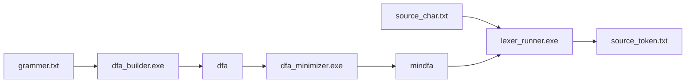
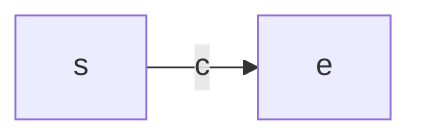
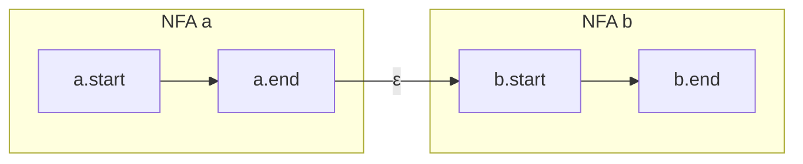

# 词法分析器实验报告

## 摘要

本实验实现了一个基于正则表达式的词法分析器（Lexer），用于将类 C 语言的源代码字符流转换为 Token 序列。词法分析器通过正则规则 → NFA → DFA → 最小化 DFA 的四阶段流水线实现，采用 Thompson 构造法将正则表达式转为 NFA、子集构造法将 NFA 转为 DFA、Hopcroft 算法对 DFA 进行最小化。最终通过贪心最长匹配策略识别 Token，支持关键字、标识符、整数、运算符和分隔符共 21 种 Token 类型。

---

## 介绍

词法分析是编译器前端的第一阶段，负责读入源程序的字符流，将其组织成有意义的词素（Lexeme），并为每个词素生成对应的 Token（种别码, 属性值）。Token 是语法分析器的基本输入单元。

本词法分析器的设计目标包括：
1. 支持正则规则配置，通过规则文件灵活定义 Token 类型
2. 自动完成正则 → NFA → DFA → 最小化 DFA 的完整转换
3. 支持关键字优先匹配（如 `if` 优先于标识符 `ID`）
4. 贪心最长匹配策略，正确处理 `==` 不会误分割为两个 `=`
5. 支持预定义字符类（\d, \w, \s）、自定义字符类（[a-z]）、转义序列和闭包运算

---

## 原理与实现

### 3.1 总体架构

词法分析器分为三个可执行程序和四个核心模块：



| 程序 | 输入 | 输出 | 功能 |
|------|------|------|------|
| `dfa_builder.exe` | `grammer.txt` | `dfa` | 正则→后缀式→Thompson NFA→子集构造 DFA |
| `dfa_minimizer.exe` | `dfa` | `mindfa` | Hopcroft 算法最小化 DFA |
| `lexer_runner.exe` | `mindfa` + `source_char.txt` | `source_token.txt` | 贪心最长 Token 匹配 |

### 3.2 核心文件结构

| 文件 | 功能 |
|------|------|
| `automata.h / automata.cpp` | DFA/NFA 状态数据结构，mindfa 文件读写 |
| `regex_nfa_dfa.h / regex_nfa_dfa.cpp` | 正则解析、后缀转换、NFA 构造、DFA 子集构造 |
| `dfa_minimize.h / dfa_minimize.cpp` | Hopcroft DFA 最小化算法 |
| `dfa_builder.cpp` | 主程序：组合规则、构造总 NFA、转为 DFA |
| `dfa_minimizer.cpp` | 主程序：读取 DFA、最小化、输出 mindfa |
| `lexer_runner.cpp` | 主程序：载入 mindfa，贪心匹配 Token |

### 3.3 正则表达式 → 后缀表达式（Shunting-Yard 算法）

正则文法支持以下运算：

| 运算 | 符号示例 | 优先级 |
|------|----------|--------|
| 闭包 | `*` `+` | 3（最高） |
| 连接 | `ab`（隐式） | 2 |
| 选择 | `|` | 1（最低） |

实现位于 `regex_nfa_dfa.cpp` 的 `infixToPostfixTokens()` 函数（行 518-555）。

**处理步骤：**
1. **字符类展开**（`tokenizeAndExpandTokens`）：将 `[a-z]` 展开为 `(a|b|...|z)`；将 `\d` 展开为 `(0|1|...|9)`；将 `\w` 展开为 `(a|b|...|z|A|...|Z|0|...|9|_)`
2. **插入连接符**（`addConcatTokens`）：在隐式连接处（字面量紧邻字面量、`)`紧邻`(` 等）插入 `.` 运算符
3. **Shunting-Yard 转换**：操作数直接输出，运算符按优先级弹栈

转换示例：`[0-9][0-9]*` → 展开 → `(0|...|9)(0|...|9)*` → 插入连接符 → `(0|...|9).(0|...|9)*.` → 后缀式 → `0|...|9 0|...|9* .`

### 3.4 Thompson 构造法：后缀式 → NFA

位于 `regex_nfa_dfa.cpp` 的 `buildNFAFromPostfixTokens()` 函数（行 593-626）。

三种基本 NFA 片段：

**(1) 单字符 NFA（`tok_single`，行 292-297）：**

创建两个新状态，状态 s 经字符 c 转移到状态 e。

**(2) 连接 NFA（`tok_concat`，行 299-302）：**

将第一个 NFA 的终态通过 ε 边连接到第二个 NFA 的初态。

**(3) 并运算 NFA（`tok_unite`，行 304-312）：**
创建新的初态 s 和终态 e，s 通过 ε 边分别连到两个子 NFA 的初态，两个子 NFA 的终态通过 ε 边连到 e。

**(4) 闭包 NFA（`tok_star`，行 314-322）：**
创建新的初态 s 和终态 e：
- s ──ε──→ NFA 初态
- s ──ε──→ e（允许零次匹配）
- NFA 终态 ──ε──→ NFA 初态（实现循环）
- NFA 终态 ──ε──→ e（结束闭包）

**(5) `+` 闭包（正闭包，行 613-618）：**
`a+ = a · a*`，先克隆原 NFA，再将其与克隆的 `*` 闭包连接。

### 3.5 子集构造法：NFA → DFA

位于 `regex_nfa_dfa.cpp` 的 `buildDFA()` 函数（行 746-798）。

**算法流程：**
1. 计算 NFA 初始状态的 ε-闭包作为 DFA 的初态
2. 使用 BFS 遍历所有 DFA 状态：
   - 对当前 DFA 状态中的每个 NFA 状态集合，计算每个输入字符 c 的转移集合
   - move(S, c) = { t | ∃s∈S, s→c→t }（字符转移）
   - dtran(S, c) = ε-closure(move(S, c))（ε-闭包）
   - 若该集合未出现过，则创建新 DFA 状态并入队
3. 接受态判定：若 DFA 状态包含的 NFA 状态集合中含有接受态，则该 DFA 状态也是接受态
4. **多规则冲突消解**（行 779-795）：当同一 DFA 状态包含多个接受态时，选择 `acceptPriority` 最小的（即规则文件中排在前面的，如关键字 `if` 优先于标识符 `ID`）

### 3.6 Hopcroft 算法：DFA 最小化

位于 `dfa_minimize.cpp` 的 `minimizeDFA()` 函数（行 8-137）。

**算法流程：**
1. **可达性过滤**（行 10-26）：从初态 BFS 收集所有可达状态，排除不可达状态
2. **构建反向转移表**（行 29-37）：`rev[c][target] = {sources}`，便于后续按前驱划分
3. **初始划分**（行 39-58）：接受态按 tokenType 分组（如 `ID` 状态一组，`INT` 状态一组），非接受态为一组
4. **细化迭代**（行 60-101）：对每个划分块 A 和字符 c，找出所有经过 c 能转移到 A 中状态的前驱集合 X，按 X 将每个现有块 Y 分裂为 Y∩X 和 Y\X
5. **构造最小 DFA**（行 104-135）：每个划分块成为一个新状态，转移边由代表状态决定

### 3.7 贪心最长匹配

位于 `lexer_runner.cpp` 的 `main()` 函数（行 62-111）。

**算法流程：**
1. 从当前位置 i 开始，沿 DFA 逐个字符推进
2. 使用变量 `lastAcceptPos` 和 `lastAcceptType` 记录最后到达接受态的位置和 Token 类型
3. 当无法继续推进（转移不存在）时停止
4. 回退到最近一次接受态的位置，输出对应 Token，将扫描位置更新为该位置
5. 若全程未到达接受态，则报告词法错误并跳过当前字符
6. `WS`（空白）和 `COMMENT`（注释）类型的 Token 被过滤不输出

**最长匹配示例**：输入 `if (x == 5)` 中 `if` 不会被误认为标识符 `i`，因为 `if` 能推进更远且到接受态时被识别为 `IF` 关键字。

---

## 实验过程

### 4.1 规则配置

词法规则文件 `grammer.txt` 包含 21 条规则：

| Token | 正则 | 说明 |
|-------|------|------|
| WS | `[ \t\n]+` | 空白（跳过） |
| IF | `if` | 关键字 if |
| ELSE | `else` | 关键字 else |
| WHILE | `while` | 关键字 while |
| INT_KW | `int` | 关键字 int（保留） |
| RETURN | `return` | 关键字 return |
| ID | `[A-Za-z_][A-Za-z0-9_]*` | 标识符 |
| INT | `[0-9][0-9]*` | 整数 |
| EQ | `==` | 相等比较 |
| ASSIGN | `=` | 赋值 |
| PLUS | `\+` | 加号 |
| MINUS | `-` | 减号 |
| MUL | `\*` | 乘号 |
| DIV | `/` | 除号 |
| POW | `\^` | 指数 |
| LPAREN | `\(` | 左括号 |
| RPAREN | `\)` | 右括号 |
| LBRACE | `\{` | 左花括号 |
| RBRACE | `\}` | 右花括号 |
| SEMI | `;` | 分号 |
| COMMA | `,` | 逗号（保留） |

### 4.2 测试用例

输入 `source_char.txt`：
```
x = 5;
y = 10;
z = 2 ^ 3;
w = x + y * z;
if (x == 5) {
  r = x + y * 2;
  r = r + 1;
}
while (x == 5) {
  x = x + 1;
}
return w;
```

### 4.3 输出结果

```
ID: x
ASSIGN: =
INT: 5
SEMI: ;
ID: y
ASSIGN: =
INT: 10
SEMI: ;
ID: z
ASSIGN: =
INT: 2
POW: ^
INT: 3
SEMI: ;
ID: w
ASSIGN: =
ID: x
PLUS: +
ID: y
MUL: *
ID: z
SEMI: ;
IF: if
... (共 61 个 Token)
```

**关键验证点：**
- `2 ^ 3` 中的 `^` 被正确识别为 POW Token
- `==` 被正确识别为 EQ 而非两个 ASSIGN
- 关键字 `if`、`while`、`return` 未被误识别为标识符
- 空白符被正确过滤

---

## 总结

本实验成功实现了一个功能完整的词法分析器，涵盖从正则规则到最终 Token 输出的完整流水线。通过模块化设计，正则解析、NFA 构造、DFA 转换、DFA 最小化和 Token 匹配各自独立，便于调试和扩展。算法方面采用了编译原理中的经典方法：Thompson 构造法、子集构造法、Hopcroft 最小化算法和贪心最长匹配策略。关键设计细节包括多规则冲突消解（按优先级选择 Token）、预定义字符类展开、以及最长匹配实现确保关键字不被拆分。

---

## 参考资料

1. Aho, A. V., Lam, M. S., Sethi, R., & Ullman, J. D. (2006). *Compilers: Principles, Techniques, and Tools* (2nd ed.). Addison-Wesley.（"龙书"）
2. Thompson, K. (1968). Programming Techniques: Regular expression search algorithm. *Communications of the ACM*, 11(6), 419-422.
3. Hopcroft, J. E. (1971). An n log n algorithm for minimizing states in a finite automaton. *Theory of Machines and Computations*, 189-196.
4. Dijkstra, E. W. (1961). Algol 60 translation: An algol 60 translator for the x1 and making a translator for algol 60. *ALGOL Bulletin*, (10).
