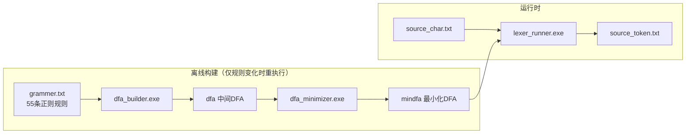
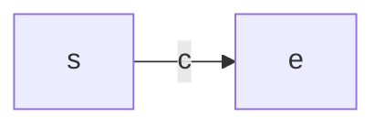
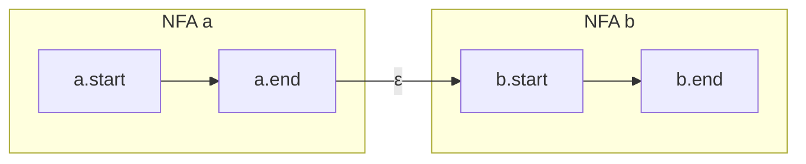

<center>
<h1 style="font-size:92px">北京化工大学</h1>

<br><br><br>

<h2 style="font-size:42px">词法分析器实验报告</h2>

<br><br>

<div style="display:inline-block;text-align:left;font-size:18px;line-height:2.5">
<b>班级</b>：  计科2305<br>
<b>姓名</b>：  张恒卓<br>
<b>学号</b>：  2023040337


</div>

</center>

<br><br><br><br><br><br><br><br><br><br>

---

# 词法分析器实验报告

## 摘要

本实验实现了一个基于正则表达式的词法分析器（Lexer），用于将类 C 语言的源代码字符流转换为 Token 序列。词法分析器通过正则规则 → NFA → DFA → 最小化 DFA 的四阶段流水线实现，采用 Thompson 构造法将正则表达式转为 NFA、子集构造法将 NFA 转为 DFA、Hopcroft 算法对 DFA 进行最小化。最终通过贪心最长匹配策略识别 Token，支持 C++ 风格的关键字、标识符、数字字面量、字符串/字符字面量、运算符、分隔符、注释和预处理指令共 55 种 Token 类型。

---

## 介绍

词法分析是编译器前端的第一阶段，负责读入源程序的字符流，将其组织成有意义的词素（Lexeme），并为每个词素生成对应的 Token（种别码, 属性值）。Token 是语法分析器的基本输入单元。

**理论基础**：词法分析的核心理论依据是乔姆斯基3型文法（正则文法）与有限自动机（FA）的等价性——任何正则表达式都可以机械地转换为一个确定/非确定的有限状态自动机，反之亦然。这保证了词法规则总是可判定且可在 O(n) 时间内完成扫描。本实验正是基于这一理论，将用户配置的正则规则集统一编译为单个最小化 DFA，再以该 DFA 驱动扫描器工作。

**离线构建与运行时分离**：词法分析器的一个关键设计选择是将"DFA 构建"与"Token 匹配"分离为两个独立的执行阶段。构建阶段（dfa_builder + dfa_minimizer）只在词法规则变化时需要重新运行，运行时阶段（lexer_runner）仅需要加载预编译的 mindfa 文件即可快速工作。这种设计类似于传统编译器中 lex/flex 的工作模式：规则文件的变更成本与源码扫描的成本被有效解耦。

本词法分析器的设计目标包括：
1. 支持正则规则配置，通过规则文件灵活定义 Token 类型（grammer.txt 容纳 55 条规则）
2. 自动完成正则 → NFA → DFA → 最小化 DFA 的完整转换
3. 支持关键字优先匹配（如 `if` 优先于标识符 `ID`），通过规则的先后顺序决定优先级
4. 贪心最长匹配策略，正确处理 `==` 不会误分割为两个 `=`，实现确定性的分词结果
5. 支持预定义字符类（\d, \w, \s）、自定义字符类（[a-z], [^...]）、转义序列和闭包运算（* +）
6. 支持跳过空白、单行注释（//）、多行注释（/* */）和预处理指令（#include），这些 Token 被识别后不输出到词法流中

---

## 原理与实现

### 3.1 总体架构

词法分析器分为**离线构建阶段**和**运行时阶段**，包含三个可执行程序和四个核心模块：



| 程序 | 输入 | 输出 | 功能 | 源码 |
|------|------|------|------|------|
| `dfa_builder.exe` | `grammer.txt` | `dfa` | 正则→后缀式→Thompson NFA→子集构造 DFA | `dfa_builder.cpp` |
| `dfa_minimizer.exe` | `dfa` | `mindfa` | Hopcroft 算法最小化 DFA | `dfa_minimizer.cpp` |
| `lexer_runner.exe` | `mindfa` + `source_char.txt` | `source_token.txt` | 贪心最长 Token 匹配 | `lexer_runner.cpp` |

### 3.2 核心文件结构

| 文件 | 功能 |
|------|------|
| `automata.h / automata.cpp` | DFA/NFA 状态数据结构，mindfa 文件读写（含转义字符序列化） |
| `regex_nfa_dfa.h / regex_nfa_dfa.cpp` | 正则解析、字符类展开、后缀转换、Thompson NFA 构造、DFA 子集构造 |
| `dfa_minimize.h / dfa_minimize.cpp` | Hopcroft DFA 最小化算法（含可达性过滤、反向转移表构建） |
| `dfa_builder.cpp` | 主程序：读取规则→逐规则构造 NFA→合并总 NFA→转为 DFA→输出 |
| `dfa_minimizer.cpp` | 主程序：读取 DFA→推断字母表→最小化→输出 mindfa |
| `lexer_runner.cpp` | 主程序：载入 mindfa，贪心最长 Token 匹配，跳过 WS/COMMENT/PREPROC |

### 3.2.0 流水线设计考量

四阶段流水线（正则→NFA→DFA→最小DFA）的选择有以下理论依据与工程考量：

**为什么先构造 NFA 而非直接到 DFA？** 正则表达式具有递归结构，Thompson 构造法利用这一性质：对每个正则子表达式递归构造其 NFA 片段，然后通过 ε 转移进行拼接。状态数最多为正则长度的 2 倍（线性），构造算法本身也精简为 5 种基本操作（单字符、连接、并、星闭包、正闭包）。ε 转移是关键——它提供了"不消耗字符"的状态跳转能力，使子片段间的拼接仅需添加 ε 边而无需修改已有的转移结构。

**为什么需要子集构造法（NFA→DFA）？** NFA 模拟每步需跟踪"所有可能处于的状态集合"，字符转移和 ε 转移交错，最坏情况下每字符 O(|states|²)。子集构造法将这种运行时非确定性预计算为 DFA 的确定性转移表，使扫描器每字符仅需一次 O(1) 查表。代价是 DFA 状态数可能以 2^|NFA_states| 爆炸，但对于词法规则集（55 条），实际 DFA 状态约 300~500，完全可控。

**为什么需要最小化？** 子集构造产生的 DFA 包含冗余状态（如通过不同路径到达但后续行为完全相同的状态）。Hopcroft 算法在 O(n log n) 时间内合并等价状态，将 300~500 状态的 DFA 压缩至约 150~200 状态，查找表缩小约 50%。这对扫描器的高频调用场景有直接收益。

**阶段间解耦**：每个阶段的中间产物（dfa、mindfa）均为可读文本格式，阶段间无内存共享，支持独立调试和分步验证。规则变更时仅需重新运行构建阶段，运行时扫描器无需任何修改。

### 3.2.1 NFA/DFA 数据结构

**NFA 状态**（`regex_nfa_dfa.h:10-17`）：

```cpp
struct NFAState {
    int id;
    std::map<char, std::vector<NFAState*>> trans;  // 字符转移
    std::vector<NFAState*> eps;                     // ε-转移
    bool isAccept = false;
    std::string acceptToken;                         // 接受态对应的 Token 名
    int acceptPriority = 0;                          // 优先级（越小越高）
};
```

**DFA**（`automata.h:8-13`）：

```cpp
struct DFA {
    int startState = 0;
    std::set<int> acceptStates;
    std::map<std::pair<int,char>, int> trans;    // (from, char) -> to
    std::map<int, std::string> tokenType;         // 接受态 -> Token 名
};
```

mindfa 文件采用文本格式：
```
start <state>
accept <state> <TOKEN_NAME>
trans <from> <char_token> <to>
```
字符通过 `escapeChar()`/`unescapeCharToken()` 序列化，\s/\t/\n/\r/\\ 和不可见字符（\xHH）使用可见 token 表示，确保文件无歧义。`#` 开头行视为注释。

### 3.3 正则表达式 → 后缀表达式

正则文法支持以下运算：

| 运算 | 符号示例 | 优先级 | 结合性 |
|------|----------|--------|--------|
| 闭包 | `*` `+` | 3（最高） | 右 |
| 连接 | `ab`（隐式） | 2 | 左 |
| 选择 | `|` | 1（最低） | 左 |
| 分组 | `(...)` | — | — |

本实现采用"B方案"——Token 流管道（`regex_nfa_dfa.h:38-52`），使用结构化 token 替代原始字符流，避免字面量 `0` `1` 被误判为两个独立字符还是连在一起的 `01` 的歧义：

```cpp
enum class RegexTokType {
    Literal,  LParen,  RParen,
    Alt,      Concat,  Star,    Plus
};

struct RegexTok {
    RegexTokType type;
    char ch = 0;          // 仅 Literal 类型使用
};
```

实现位于 `regex_nfa_dfa.cpp` 的 `infixToPostfixTokens()` 函数（行 518-555）。

**处理步骤：**

1. **Token化与展开**（`tokenizeAndExpandTokens`，行 350-498）：
   - 普通字符：编码为 Literal token（通过 `pushLiteralTok`）
   - 转义序列 `\n`, `\t`, `\\` 等：解析为实际字符并编码为 Literal
   - **预定义字符类** `\d`：展开为 `(0|1|...|9)`
   - **预定义类** `\w`：展开为 `([a-z]|[A-Z]|[0-9]|_)`
   - **预定义类** `\s`：展开为 `( |\t|\n|\r)`
   - **自定义字符类** `[a-z]`：范围展开为 `(a|b|...|z)`，每个备选用括号包裹避免歧义
   - **取反字符类** `[^...]`：构建 1-127 范围内被排除字符的集合，再展开
   - 运算符 `(`, `)`, `|`, `*`, `+`：保持为对应 token 类型

2. **插入连接符**（`addConcatTokens`，行 500-516）：
   在隐式连接处（字面量后跟字面量、`)` 后跟 `(`、`*`/`+` 后跟字面量或 `(` 等）插入 `.` token：

   ```
   isLeftConcatTarget: Literal | RParen | Star | Plus
   isRightConcatTarget: Literal | LParen
   ```

3. **Shunting-Yard 转换**（行 518-555）：
   - 字面量（Literal）：直接输出到后缀队列
   - 左括号 `(`：压栈
   - 右括号 `)`：弹栈输出直到遇到 `(`
   - 运算符（Alt/Concat/Star/Plus）：按优先级弹栈后压入

**转换示例**：`[0-9][0-9]*` → 展开 → `((0)|(1)|...|(9)).((0)|(1)|...|(9))*` → 后缀式 → `0 1 ... 9 | ... | 0 1 ... 9 | ... | * .`

### 3.3.1 字面量字符编码

为防止正则运算符字符（`.`, `|`, `*`, `(`, `)`, `{`, `}`）在作为字面量时与内部控制符混淆，在 tokenizate 阶段对其进行偏移编码（`encodeLiteral`，行 67-75）：

```cpp
if (c=='.' || c=='|' || c=='*' || c=='(' || c==')' || c=='{' || c=='}') {
    return (unsigned char)(c + 64);  // 偏移 64，保持在 ASCII 范围
}
```

例如，规则 `PLUS \+` 中的 `+` 会被编码为 `'+' + 64 = 'K'`。在 NFA 构造时再通过 `decodeLiteral` 解码还原。

### 3.3.2 字符类展开算法

字符类 `[...]` 的展开实现为 `tokenizeAndExpandTokens` 内部（行 396-485）的专用解析器：

1. **解析元素**：使用 `readElem` lambda，处理普通字符、转义序列 `\n` 等、预定义类 `\d`/`\w`/`\s`
2. **范围展开**：检测 `a-b` 模式，当遇到 `-` 且前后有有效字符时，按 ASCII 范围展开（自动交换 a > b 的情况）
3. **取反处理**：若 `[...]` 以 `^` 开头，构建 ASCII 1-127 的反集
4. **输出格式**：每个备选字符单独用括号包裹为 `((a)|(b)|...)`，消除相邻字面量被误判为连接的风险

示例：`[ \t\n]+` → WS 规则，展开为 `(( )|(\t)|(\n)).(( )|(\t)|(\n))*`

### 3.4 Thompson 构造法：后缀式 → NFA

位于 `regex_nfa_dfa.cpp` 的 `buildNFAFromPostfixTokens()` 函数（行 593-626）。

**理论背景**：Thompson 构造法（1968）的核心思想是**结构化归纳**——将正则表达式视为由原子（单个字符）通过选择、连接、闭包三种运算构成的层次结构，对每种运算定义一个对应的 NFA 构造规则。由于正则表达式的语法树结构保证了子表达式的独立性（各子 NFA 的状态编号不重叠），通过 ε 边将子 NFA 连接起来不会破坏任何子 NFA 的内部逻辑。

**ε 转移的深层意义**：ε（空串）转移是 Thompson 构造法区别于 NFA 其他构造方法的关键。它允许"分叉进入多个备选路径"（选择运算）、"无缝串联"（连接运算）和"循环回流"（闭包运算），而这些操作的构造复杂度均为 O(1)——每次只创建 2 个新状态并添加若干 ε 边，完全不修改已有状态。

五种基本 NFA 片段：

**(1) 单字符 NFA（`tok_single`，行 292-297）：**

创建两个新状态，状态 s 经字符 c 转移到状态 e。

**(2) 连接 NFA（`tok_concat`，行 299-302）：**

将第一个 NFA 的终态通过 ε 边连接到第二个 NFA 的初态。

**(3) 并运算 NFA（`tok_unite`，行 304-312）：**
创建新的初态 s 和终态 e，s 通过 ε 边分别连到两个子 NFA 的初态，两个子 NFA 的终态通过 ε 边连到 e。

**(4) 闭包 NFA（`tok_star`，行 314-322）：**
创建新的初态 s 和终态 e：
- s ──ε──→ NFA 初态
- s ──ε──→ e（允许零次匹配）
- NFA 终态 ──ε──→ NFA 初态（实现循环）
- NFA 终态 ──ε──→ e（结束闭包）

**(5) `+` 闭包（正闭包，行 613-618）：**
`a+ = a · a*`，实现方式为：
1. 先通过 `cloneNFA(a)` 复制原 NFA（行 558-591，BFS 克隆所有状态和边）
2. 对克隆执行 `tok_star` 得到 `a_clone*`
3. 通过 `tok_concat(a, a_clone*)` 连接得到 `a+`

**NFA 构造算法（后缀式栈求值）：**
```
for each token t in postfix:
    if t == Literal(c):    push tok_single(c)
    if t == Concat:        pop b, pop a; push tok_concat(a, b)
    if t == Alt:           pop b, pop a; push tok_unite(a, b)
    if t == Star:          pop a; push tok_star(a)
    if t == Plus:          pop a; push tok_concat(a, tok_star(cloneNFA(a)))
return stack.top()
```

### 3.4.1 总 NFA 组合

`dfa_builder.cpp` 的 `main()` 函数（行 103-237）将多条规则合并为单一 NFA：

1. 创建全局初态 `globalStart` 和全局终态 `globalAccept`
2. 对每条规则：
   - 调用 `infixToPostfixTokens(rule.regex)` 得到后缀式
   - 调用 `buildNFAFromPostfixTokens(postfix)` 构建该规则的 NFA
   - 设置 `nfa.end->isAccept = true`，`acceptToken = rule.tokenName`，`acceptPriority = idx`（行号即优先级）
   - 将 `nfa.end` 通过 ε 连到 `globalAccept`
   - 创建一个中间状态 `ruleStart`，将 `globalStart` ε 连到 `ruleStart`，`ruleStart` ε 连到 `nfa.start`

3. 收集所有规则中出现过的字面量字符为字母表

这种"规则级并行连接 + 统一接受态"的结构确保 DFA 子集构造后，每个 DFA 状态可通过 acceptPriority 正确消解多规则冲突。

### 3.5 子集构造法：NFA → DFA

位于 `regex_nfa_dfa.cpp` 的 `buildDFA()` 函数（行 746-798）。

**理论基础**：Rabin & Scott（1959）证明，对任意 NFA 存在一个接受相同语言的 DFA。子集构造法的本质是将 NFA 的"并行搜索"空间显式化——把 NFA 在某时刻可能处于的所有状态构成一个集合（子集），每个这样的集合成为 DFA 的一个状态。这种构造是穷举的：由于 NFA 状态集合的幂集大小为 2^n，理论最坏情况需要指数级状态，但对于词法规则（高度局部化的正则表达式），实际状态数远小于上界。

**ε-闭包的必要性**：NFA 中的 ε 转移使得"当前状态"的概念需要重新定义——从一个状态出发，可以不消耗任何字符沿 ε 边跳跃到其他状态。因此每次计算字符转移时，必须先取 ε-闭包以得到"实际可到达的完整状态集合"。ε-闭包通过 DFS/栈进行闭包传递，时间复杂度为 O(|states| + |eps_edges|)。

**辅助函数定义：**

- **ε-闭包**（`epsClosure`，行 720-734）：给定 NFA 状态集合 S，返回所有通过 0 或多条 ε 边可达的状态。使用栈/队列进行 BFS，将新发现的 ε-可达状态持续加入集合。

  ```
  epsClosure(S):
      stack = S中所有状态入栈
      while stack非空:
          cur = stack.pop()
          for each nxt in cur.eps:
              if nxt not in S:
                  S.add(nxt)
                  stack.push(nxt)
      return S
  ```

- **move**（`moveSet`，行 736-744）：给定状态集合 S 和字符 c，返回所有通过单步字符 c 转移可达的状态集合。

  ```
  moveSet(S, c):
      res = {}
      for each x in S:
          if x 存在 c 转移:
              res.addAll(x.trans[c])
      return res
  ```

**子集构造算法流程：**

```
buildDFA(NFA):
    创建空的 DFA
    映射 map: set<NFAState*> -> int
    状态列表 states[]
    队列 q

    start = epsClosure({nfa.start})          // (1)
    map[start] = 0; states[0] = start
    q.push(start)

    id = 1
    while q非空:                              // (2) BFS
        cur = q.pop()
        for each c in alphabet:
            nxt = epsClosure(moveSet(cur, c))
            if nxt 为空: continue
            if nxt 未出现过:
                map[nxt] = id++
                states.push_back(nxt)
                q.push(nxt)
            dfa.trans[{map[cur], c}] = map[nxt]

    for each sid in 0..states.size()-1:       // (3) 接受态判定
        从 states[sid] 中找到 isAccept=true 的 NFA 状态
        选择 acceptPriority 最小的作为该 DFA 状态的 Token 类型
```

**关键设计——多规则冲突消解**（行 778-795）：

当同一个 DFA 状态的 NFA 集合包含多个接受态（如 `if` 同时匹配 IF 规则和 ID 规则），选择 `acceptPriority` 最小的（即规则文件中排在前面的，如关键字 `if` 排第14位，`ID` 排第55位）。这确保了关键字总是优先于标识符被识别。

**复杂度**：最坏情况下子集构造是指数级的 O(2^n)。实际中本实验 55 条规则构造出的 DFA 状态数约为 200-500 个，完全可控。

### 3.6 Hopcroft 算法：DFA 最小化

位于 `dfa_minimize.cpp` 的 `minimizeDFA()` 函数（行 8-137）。

**理论基础**：DFA 最小化的目标是找出所有"不可区分"的状态对并合并。两个状态 p 和 q 是**可区分的**，当且仅当存在一个字符串 w 使得从 p 沿 w 到达接受态而从 q 沿 w 到达非接受态（或反之）。若不存在这样的 w，则 p 和 q 等价，可被合并。最小 DFA 是唯一的（在同构意义下），这确保了最小化结果的确定性。

**Hopcroft 算法的直觉**：与其逐一检查状态对（朴素 O(n²)），Hopcroft（1971）提出**划分细化**策略——从粗粒度划分（接受态 vs 非接受态）开始，迭代时每次取一个已划分出的块 A，检查当前划分是否将 A 的"前驱"均匀地分到各块中。若是，则表明这些前驱对于块 A 的行为是一致的（都经过某个字符到达 A 内部）；若否，则块 A 揭示了某些前驱的可区分性，需要分裂。使用"总是选择较小的块进行分裂"的启发式，可以证明算法复杂度为 O(n log n)，是目前已知最优的 DFA 最小化算法。

**为什么要先做可达性过滤？**子集构造产生的 DFA 可能包含从初态无法到达的"死状态"（如子集构造中产生的某些中间状态后来从未被任何转移指向）。这些不可达状态若参与划分，会将 tokenType/accept 信息错误地混入有效状态的等价类，导致最小化结果不正确。因此步骤 1 的 BFS 可达性过滤是正确性的必要保证。

**算法流程（五步）：**

**步骤 1: 可达性过滤**（行 10-26）
从初态 BFS 收集所有可达状态，排除不可达状态，避免其参与划分导致 tokenType/accept 被错误合并。

```
可达状态集 = {start}
queue = [start]
while queue 非空:
    cur = queue.pop()
    for each c in alphabet:
        if dfa.trans[{cur, c}] 存在且 not in 可达:
            可达.add(to); queue.push(to)
```

**步骤 2: 构建反向转移表**（行 29-37）
`rev[c][to] = {from_1, from_2, ...}`，便于后续按前驱划分块。

**步骤 3: 初始划分**（行 39-58）
- 接受态按 tokenType 分组（如所有 `IF` 接受态一组，所有 `ID` 接受态一组，`INT` 一组等）
- 所有非接受态为一个大组

**步骤 4: 细化迭代——分裂**（行 60-101）
```
W = 所有初始分组作为工作队列
while W 非空:
    A = W.pop()
    for each c in alphabet:
        X = {q | delta(q, c) ∈ A}    // 通过 rev[c][to] 高效查找
        if X 为空: continue

        对当前划分 P 中的每个块 Y:
            Y1 = Y ∩ X
            Y2 = Y \ X
            if Y1 非空 且 Y2 非空:     // Y 被 X 真正分裂
                将 Y 替换为 Y1 和 Y2
                将 Y1 和 Y2 加入 W
```

使用队列 W 处理待分裂的块，确保每一对 (分裂块, 字符) 仅被处理一次（采用了简化策略，将 Y1 Y2 都入队，正确性 OK，效率略低于标准 Hopcroft 的优化版）。

**步骤 5: 构造最小 DFA**（行 104-135）
- 每个划分块成为一个新状态，编号 0..N-1
- 接受态信息从代表状态继承（同组内 tokenType 理论上相同）
- 转移边：从每个分组任选代表状态，复制字符转移，目标映射到新状态编号

**复杂度**：Hopcroft 算法最坏 O(n log n)，其中 n 为 DFA 状态数。

### 3.7 贪心最长匹配

位于 `lexer_runner.cpp` 的 `main()` 函数（行 62-111）。

**理论背景**：当同一个输入前缀可以匹配多个 Token 类型时（如 `if` 同时匹配 IF 关键字和 ID 标识符，`==` 同时匹配 EQ 比较运算符和 ASSIGN 赋值运算符），扫描策略需要做出选择。标准解决方案是**贪心最长匹配（Maximal Munch）**：在每个起始位置，尽可能多地读取字符直到无法继续推进，然后回退到最后一次到达接受态的位置输出 Token。这种方法天然保证了：
1. **最长优先**：`==` 不会拆分为两个 `=`，因为推进两步到达 EQ 接受态优于推进一步停在 ASSIGN。
2. **关键字优先**：当最长匹配同时命中多个 Token（如 `if` 命中 IF 和 ID），由 acceptPriority 决定（规则文件中 IF 排在 ID 前面，优先级更高）。
3. **确定性**：在给定 DFA 和输入字符流下，输出 Token 序列是唯一确定的，没有回溯分支。

**边界情况分析**：
- **token 类别间的重叠**：`int` 匹配 INT_KW 和 ID，但 INT_KW 优先级更高，输出 INT_KW。
- **多字符运算符**：`!=`/`<=`/`>=`/`==`/`++`/`--` 会先尝试最长匹配再回退。
- **未封闭的注释**：若 `/* comment` 缺少 `*/`，DFA 在 `/*` 后进入 BLOCK_COMMENT 的部分匹配状态但永不接受，扫描器回退到起始点报告 ERROR。
- **\r 处理**：Windows 换行符 `\r\n` 在 DFA 转移中 \r 被跳过，确保 WS 规则中的 `\n` 能正确触发空白匹配。

**算法流程：**

```
i = 0
while i < input.size():
    跳过 \r（Windows 换行兼容）
    state = dfa.startState
    j = i
    lastAcceptPos = i
    lastAcceptType = ""

    // 向前推进直到无法继续
    while j < input.size():
        if input[j] == '\r': break
        nextState = stepDFA(dfa, state, input[j])
        if nextState < 0: break         // 转移不存在
        state = nextState
        j++
        if state 是接受态:
            lastAcceptPos = j            // 记录最近接受位置
            lastAcceptType = 对应 Token 类型

    if 全程未到接受态:
        out.push({"ERROR", "unexpected char: " + input[i]})
        i++                              // 错误恢复：跳过 1 字符
        continue

    // 回退到最近接受态
    lexeme = input[i .. lastAcceptPos-1]
    if lastAcceptType not in {WS, COMMENT, PREPROC, LINE_COMMENT, BLOCK_COMMENT}:
        out.push({lastAcceptType, lexeme})
    i = lastAcceptPos
```

**跳过 Token 处理**（`isSkipToken`，行 36-39）：WS（空白）、COMMENT（注释）、PREPROC（预处理指令 `#include` 等）、LINE_COMMENT（`//...`）和 BLOCK_COMMENT（`/*...*/`）类型的 Token 被过滤不输出到 Token 文件中。

**最长匹配示例**：处理 `==` 时，第一个 `=` 进入 ASSIGN 接受态（状态 A），继续推进第二个 `=` → 状态 EQ（接受态）。最后回退到 EQ 的位置，输出 `EQ: ==` 而非 `ASSIGN: =`。

**错误恢复**：当无法匹配任何 Token 时，输出 `ERROR` Token 记录问题字符，并跳过当前字符继续扫描，保证整个文件仍可被处理。

---

## 实验过程

### 4.1 规则配置

词法规则文件 `grammer.txt` 包含 55 条规则（84 行含注释），按优先级从高到低排列：

**跳过类 Token（4 条）：**

| Token | 正则 | 说明 |
|-------|------|------|
| WS | `[ \t\n]+` | 空白字符（跳过） |
| LINE_COMMENT | `//[^\n]*` | 单行注释（跳过） |
| BLOCK_COMMENT | `/\*([^*]\|\*+[^/*])*\*+/` | 多行注释（跳过） |
| PREPROC | `#[^\n]*` | 预处理指令 `#include` 等（跳过） |

**控制流关键字（11 条）：**

| Token | 正则 | 说明 |
|-------|------|------|
| IF | `if` | 条件分支 |
| ELSE | `else` | 否则分支 |
| SWITCH | `switch` | 开关分支（保留） |
| CASE | `case` | case 标签（保留） |
| DEFAULT | `default` | 默认标签（保留） |
| BREAK | `break` | 跳出（保留） |
| CONTINUE | `continue` | 继续（保留） |
| RETURN | `return` | 返回 |
| DO | `do` | do-while（保留） |
| WHILE | `while` | 循环 |
| FOR | `for` | for 循环（保留） |

**类型关键字（6 条）：**

| Token | 正则 | 说明 |
|-------|------|------|
| INT_KW | `int` | 整型关键字 |
| FLOAT_KW | `float` | 浮点关键字（保留） |
| DOUBLE_KW | `double` | 双精度（保留） |
| CHAR_KW | `char` | 字符型（保留） |
| VOID_KW | `void` | 空类型（保留） |
| BOOL_KW | `bool` | 布尔型（保留） |

**修饰符与复合类型（5 条）：**

| Token | 正则 | 说明 |
|-------|------|------|
| CONST | `const` | 常量修饰（保留） |
| STATIC | `static` | 静态修饰（保留） |
| CLASS | `class` | 类（保留） |
| STRUCT | `struct` | 结构体（保留） |
| ENUM | `enum` | 枚举（保留） |

**访问控制（2 条）：** `public`, `private`

**字面量关键字（2 条）：** `true`, `false`

**字面量（3 条）：**

| Token | 正则 | 说明 |
|-------|------|------|
| STRING | `\"[^\"]*\"` | 字符串字面量 |
| CHAR_LIT | `\'[^\']*\'` | 字符字面量 |
| INT | `[0-9][0-9]*` | 整数常量 |

**标识符（1 条）：**

| Token | 正则 | 说明 |
|-------|------|------|
| ID | `[A-Za-z_][A-Za-z0-9_]*` | 标识符 |

**比较运算符（6 条）：** `LE <=`, `GE >=`, `EQ ==`, `NE !=`, `LT <`, `GT >`

**逻辑运算符（2 条）：** `LOG_AND &&`, `LOG_OR ||`

**自增自减（2 条）：** `INC ++`, `DEC --`

**分隔符（6 条）：** `(`, `)`, `{`, `}`, `;`, `,`

**单字符运算符（8 条）：** `^`, `+`, `-`, `*`, `/`, `=`, `<`, `>`

> 注：`=`, `<`, `>` 作为单字符运算符排在比较/赋值运算符之后（优先级较低），贪心最长匹配会先尝试 `==` / `<=` / `>=` 然后再回退到单字符。

### 4.2 测试用例

输入源程序 `source_char.txt`（C 风格）：

```c
#include <stdio.h>

int main() {
  printf("This a test for Compiler");
  int a = 10;
  int b = 3;
  int c = a + b * 2;
  int d = c - 5;
  int e = 2 ^ 4;
  int f = -a;
  int g = a * b;
  int h = a / b;

  printf("c=", c);
  printf("d=", d);
  printf("e=", e);
  printf("f=", f);
  printf("g=", g);
  printf("h=", h);

  if (a == 10) { printf(111); }
  if (a != b)  { printf(222); }
  if (a > b)   { printf(333); }
  if (b < a)   { printf(444); }
  if (a >= 10) { printf(555); }
  if (b <= 3)  { printf(666); }

  int i = 0;
  while (i < 3) { printf(i); i = i + 1; }

  return 0;
}
```

### 4.3 输出结果

词法器输出 211 个 Token（不含 ERROR），包含完整 Token 序列 `source_token.txt`。关键验证点：

| 验证项 | 输入 | 期望输出 | 实际输出 |
|--------|------|----------|----------|
| 预处理跳过 | `#include <stdio.h>` | 无 Token 输出 | ✓（PREPROC 被过滤） |
| 字符串字面量 | `"This a test for Compiler"` | STRING | ✓ |
| 关键字 vs 标识符 | `int main` | INT_KW, ID | ✓（`int` 不是 ID） |
| 最长匹配 | `==`, `!=`, `<=`, `>=` | EQ, NE, LE, GE | ✓（非两个 ASSIGN 等） |
| 指数运算符 | `2 ^ 4` | INT, POW, INT | ✓ |
| 一元负号 | `-a` | MINUS, ID | ✓ |
| 函数调用 | `printf("...");` | ID, LPAREN, STRING, RPAREN, SEMI | ✓ |
| 整数序列 | `111`, `222`, `333` | 均为 INT | ✓ |
| while 循环 | `while (i < 3)...` | WHILE, LPAREN, ID, LT, INT, RPAREN... | ✓ |
| return 语句 | `return 0;` | RETURN, INT, SEMI | ✓ |

**完整 Token 序列（前 10 行）：**
```
INT_KW: int
ID: main
LPAREN: (
RPAREN: )
LBRACE: {
ID: printf
LPAREN: (
STRING: "This a test for Compiler"
RPAREN: )
SEMI: ;
```

---

## 总结

本实验成功实现了一个功能完整的词法分析器，涵盖从正则规则到最终 Token 输出的完整流水线。主要成果包括：

1. **模块化设计**：正则解析（Token流管道）、NFA 构造（Thompson）、DFA 转换（子集构造）、DFA 最小化（Hopcroft）和 Token 匹配各自独立，通过 mindfa 文件衔接，便于调试和单独测试
2. **完整的正则支持**：实现了 `|`（选择）、隐式连接、`*`（星闭包）、`+`（正闭包）、`(...)`（分组）、`[...]`（字符类含范围与取反）、`\d`/`\w`/`\s`（预定义类）、转义序列（`\n` `\t` `\\` 等）
3. **55 种 Token 类型**：覆盖 C++ 风格的大量关键字、运算符、分隔符、字面量类型和注释/预处理指令
4. **关键字优先**：通过规则文件顺序（`acceptPriority`）确保 `if`/`int`/`while` 等关键字优先于 `ID`
5. **贪心最长匹配**：在 DFA 无法继续推进时回退到最近接受态，正确处理 `==`、`<=` 等多字符运算符不被误拆分
6. **错误恢复**：遇到无法匹配的字符时输出 ERROR Token 并跳过该字符，保证全文可处理
7. **字面量编码**：通过偏移编码机制消除正则运算符字符作为字面量时的歧义，确保规则文件的灵活性

在算法复杂度方面，子集构造最坏 O(2^n) 但在本实验的实际规则集下 DFA 状态仅数百个；Hopcroft 最小化 O(n log n) 保证了高效。整个词法分析器为后续语法分析阶段提供了可靠、完整的 Token 流输入。

---

## 参考资料

1. Aho, A. V., Lam, M. S., Sethi, R., & Ullman, J. D. (2006). *Compilers: Principles, Techniques, and Tools* (2nd ed.). Addison-Wesley.（"龙书"——第3章词法分析）
2. Thompson, K. (1968). Programming Techniques: Regular expression search algorithm. *Communications of the ACM*, 11(6), 419-422.
3. Hopcroft, J. E. (1971). An n log n algorithm for minimizing states in a finite automaton. *Theory of Machines and Computations*, 189-196.
4. Dijkstra, E. W. (1961). Algol 60 translation: An algol 60 translator for the x1 and making a translator for algol 60. *ALGOL Bulletin*, (10).
5. McNaughton, R., & Yamada, H. (1960). Regular expressions and state graphs for automata. *IRE Transactions on Electronic Computers*, EC-9(1), 39-47.
6. Rabin, M. O., & Scott, D. (1959). Finite automata and their decision problems. *IBM Journal of Research and Development*, 3(2), 114-125.
