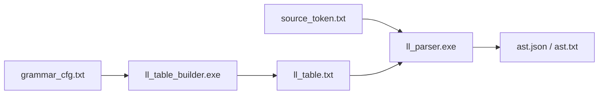

# 语法分析器实验报告

## 摘要

本实验实现了一个基于 LL(1) 预测分析表的语法分析器（Parser），用于将词法分析输出的 Token 序列按上下文无关文法归约为抽象语法树（AST）。语法分析器采用自顶向下的 LL(1) 预测分析方法，通过计算 FIRST/FOLLOW 集自动构造预测分析表 M[A, a]，利用分析栈驱动语法推导过程，同时在归约时自底向上构造 AST 节点。文法支持赋值、四则运算、指数运算、比较运算、if-else 条件分支、while 循环、语句块和 return 返回等语言结构，运算符优先级通过文法层次设计编码（`== < + - < * / < ^`）。

---

## 介绍

语法分析是编译器前端的第二阶段，根据语言的文法规则，将词法分析器产生的 Token 序列转换为结构化的语法树表示。本实验实现的是 LL(1) 文法分析器，属于无回溯的自顶向下分析方法。

设计目标：
1. 支持从 CFG 文法文件自动生成 LL(1) 预测分析表
2. 栈驱动的 LL(1) 预测分析，表驱动的推导过程
3. 同步构造 AST（分析栈与 Collector 栈并行维护）
4. 悬空 else 冲突的正确消解（优先匹配最近 if）
5. 运算符优先级和结合性通过文法层次编码
6. AST 输出同时支持可读文本格式和 JSON 格式

---

## 原理与实现

### 3.1 总体架构

语法分析器分为两个可执行程序：



| 程序 | 输入 | 输出 | 功能 |
|------|------|------|------|
| `ll_table_builder.exe` | `grammar_cfg.txt` | `ll_table.txt` | 解析文法 → 计算 FIRST/FOLLOW → 构造预测分析表 |
| `ll_parser.exe` | `ll_table.txt` + `source_token.txt` | `ast.json` + `parse_steps.txt` | LL(1) 分析 + AST 构造 |

### 3.2 核心文件结构

| 文件 | 功能 |
|------|------|
| `ll1.h` | 核心数据结构：Grammar, Production, LLTable, FIRST/FOLLOW 集 |
| `ll1.cpp` | 文法加载、FIRST/FOLLOW 集计算、预测分析表构造 |
| `token_io.h / token_io.cpp` | Token 文件读写 |
| `ll_table_builder.cpp` | 主程序：读文法 → 构造分析表 → 输出 |
| `ll_parser.cpp` | 主程序：LL(1) 分析 → AST 构造 → JSON 输出 |

### 3.3 文法设计

文法文件 `grammar_cfg.txt` 定义如下（运算符优先级层次由非终结符嵌套关系编码）：

```
S        → StmtList
StmtList → Stmt StmtList | eps
Stmt     → ID StmtTail SEMI
         | IF LPAREN Expr RPAREN Stmt ElseOpt
         | WHILE LPAREN Expr RPAREN Stmt
         | LBRACE StmtList RBRACE
         | RETURN Expr SEMI
         | SEMI
ElseOpt  → ELSE Stmt | eps
StmtTail → ASSIGN Expr | Term' Comp' Expr'

Expr     → Comp Expr'          # == 最低优先级
Expr'    → EQ Comp Expr' | eps
Comp     → Term Comp'          # + -
Comp'    → PLUS Term Comp' | MINUS Term Comp' | eps
Term     → Power Term'         # * /
Term'    → MUL Power Term' | DIV Power Term' | eps
Power    → Factor Power'       # ^ 最高优先级
Power'   → POW Factor Power' | eps
Factor   → LPAREN Expr RPAREN | ID | INT
```

**优先级层次（由高到低）：** Factor → Power → Term → Comp → Expr

每种优先级引入一对非终结符：`*` 和 `*'`（如 `Term → Power Term'`），其中 `*'` 处理同优先级运算符的左递归链（如 `Term' → MUL Power Term' | DIV Power Term' | eps`）。这是消除左递归的标准 LL(1) 文法改写技术。

**悬空 else 消解：** `ElseOpt → ELSE Stmt | eps`，当输入为 `ELSE` 时优先选择非 eps 产生式 `ELSE Stmt`，实现 else 与最近 if 的绑定。

**运算符结合性：** 文法是左递归消除后的等价形式，`Comp' → PLUS Term Comp'` 在其推导链中保证了加法为左结合。

### 3.4 FIRST 集计算

位于 `ll1.cpp` 的 `computeFirst()` 函数（行 174-201）。

**算法**：不动点迭代。

1. 初始化：
   - 对于终结符 a：FIRST(a) = {a}
   - 对于非终结符 A：FIRST(A) = ∅
2. 重复以下过程直到不再变化：
   - 对每个产生式 A → X₁X₂...Xₙ
   - 计算 `firstOfSequence(X₁...Xₙ)`（行 130-172）
   - 将结果加入 FIRST(A)
3. `firstOfSequence` 逻辑：从左到右遍历序列符号，取首符号的 FIRST 集；若当前符号可推出 ε，则继续取下一个符号的 FIRST；若全部符号均可推出 ε，则加入 ε

**示例**：对于产生式 `StmtTail → ASSIGN Expr | Term' Comp' Expr'`

- FIRST(StmtTail) = {ASSIGN, MUL, DIV, POW, PLUS, MINUS, EQ, LPAREN, ID, INT}

### 3.5 FOLLOW 集计算

位于 `ll1.cpp` 的 `computeFollow()` 函数（行 203-244）。

**算法**：不动点迭代。

1. 初始化：FOLLOW(开始符号) = {$}，其余非终结符的 FOLLOW = ∅
2. 重复以下过程直到不再变化：
   - 对每个产生式 A → αBβ：
     - 将 FIRST(β) - {ε} 加入 FOLLOW(B)
     - 若 β ⇒* ε（或 β 为空），则将 FOLLOW(A) 加入 FOLLOW(B)

**示例**：对于 `ElseOpt → ELSE Stmt | eps`

- FOLLOW(ElseOpt) = FOLLOW(Stmt) = {ELSE, RBRACE, RETURN, ID, IF, WHILE, LBRACE, SEMI, $}

### 3.6 预测分析表构造

位于 `ll1.cpp` 的 `buildLL1Table()` 函数（行 246-301）。

**构造方法**：分两趟填表以消解冲突。

**第一趟（行 263-277）**：处理非 ε 产生式。对每个产生式 A→α（α ≠ ε），对每个终结符 a ∈ FIRST(α)（a ≠ ε），设置 M[A, a] = 该产生式编号。

**第二趟（行 280-297）**：处理可推导 ε 的产生式。对每个产生式 A→α 且 α ⇒* ε，对每个终结符 b ∈ FOLLOW(A)，若 M[A, b] 尚未定义，则设置 M[A, b] = 该产生式编号。若已定义（如悬空 else 冲突），则保留已有条目（非 ε 产生式优先）。

**LL(1) 判定**：若任何表项 M[A, a] 被重复定义（第一趟内冲突），则该文法不是 LL(1)。

### 3.7 LL(1) 预测分析

位于 `ll_parser.cpp` 的 `main()` 函数（行 32-230）。

**栈驱动算法：**

```
初始化：栈 = [$ , S]，输入指针 ip = 0
while 栈非空:
    X = 栈顶符号
    a = 当前输入符号
    if X == $ and a == $: ACCEPT
    elif X 是终结符:
        if X == a: 匹配，出栈，ip++
        else: ERROR
    elif X 是非终结符:
        if M[X, a] 存在:
            出栈 X
            将产生式右部符号逆序压栈
        else: ERROR
```

**分析步骤输出**（parse_steps.txt）：
```
STACK: $ S
INPUT: ID ASSIGN INT SEMI ...
ACTION: INIT
---
STACK: $ StmtList
INPUT: ID ASSIGN INT SEMI ...
ACTION: S -> StmtList
---
STACK: $ Stmt StmtList
INPUT: ID ASSIGN INT SEMI ...
ACTION: StmtList -> Stmt StmtList
---
...
---
STACK: $ 
INPUT: $
ACTION: ACCEPT
```

### 3.8 AST 构造

位于 `ll_parser.cpp`（行 46-206）。

**设计**：在 LL(1) 分析的同时，维护一个 "Collector 栈" 同步构造 AST。

**过程：**
1. 展开非终结符 A → α 时，压入一个 Collector（记录父节点名 A，预计子节点数 = |α|）
2. 匹配终结符时，创建叶节点（Token 类型 + 词素），挂载到栈顶 Collector 的 children 中，remaining 数减 1
3. 处理 ε 产生式时，直接创建空子节点列表的 AST 节点
4. 当 Collector 的 remaining 减为 0 时，所有子节点收集完毕，创建父节点并弹出 Collector，将父节点挂载到上一层 Collector

**输出格式（JSON）：**
```json
{"sym":"S","children":[{"sym":"StmtList","children":[
  {"sym":"Stmt","children":[
    {"sym":"ID","lexeme":"x"},
    {"sym":"StmtTail","children":[
      {"sym":"ASSIGN","lexeme":"="},
      {"sym":"Expr","children":[...]}
    ]},
    {"sym":"SEMI","lexeme":";"}
  ]},
  ...
]}]}
```

---

## 实验过程

### 4.1 文法验证

使用 `ll_table_builder.exe` 生成分析表，输出 `isLL1=false` 警告仅来自悬空 else 冲突（ELSE 同时出现在 ElseOpt → eps 的 FOLLOW 和 ElseOpt → ELSE Stmt 的 FIRST 中），该冲突已通过算法正确消解（非 eps 产生式优先）。

### 4.2 测试用例

输入 Token 序列（由词法分析器对以下源码生成）：
```
x = 5;
y = 10;
z = 2 ^ 3;
w = x + y * z;
if (x == 5) { r = x + y * 2; r = r + 1; }
while (x == 5) { x = x + 1; }
return w;
```

### 4.3 分析结果

- **输出**：`ACCEPT`（分析成功）
- **parse_steps.txt**：完整的栈变化和推导步骤
- **ast.json**：完整的抽象语法树（含指数运算 `2^3` 对应的 Power → Power' → POW Factor 结构）
- **ast.txt**：可读的树状 AST

### 4.4 AST 正确性验证

```json
// z = 2 ^ 3 的 AST 片段
{"sym":"Stmt","children":[
  {"sym":"ID","lexeme":"z"},
  {"sym":"StmtTail","children":[
    {"sym":"ASSIGN","lexeme":"="},
    {"sym":"Expr","children":[
      {"sym":"Comp","children":[
        {"sym":"Term","children":[
          {"sym":"Power","children":[
            {"sym":"Factor","children":[{"sym":"INT","lexeme":"2"}]},
            {"sym":"Power'","children":[
              {"sym":"POW","lexeme":"^"},
              {"sym":"Factor","children":[{"sym":"INT","lexeme":"3"}]},
              {"sym":"Power'"}
            ]}
          ]},
          {"sym":"Term'"}
        ]},
        {"sym":"Comp'"}
      ]},
      {"sym":"Expr'"}
    ]}
  ]},
  {"sym":"SEMI","lexeme":";"}
]}
```

**验证点：**
- 指数运算符 `^` 通过 Power/Power' 层次正确解析，优先级高于 `*` `/`
- `x + y * z` 中乘法先于加法（Term 在 Comp 内部）
- if-else 正确绑定
- while 循环体正确嵌套

---

## 总结

本实验实现了一个完整的 LL(1) 预测语法分析器。通过 FIRST/FOLLOW 集的不动点迭代计算和预测分析表的自动构造，语法分析器能够从文法描述文件自举生成分析表。采用栈驱动分析算法和 Collector 栈同步构造 AST，实现了高效的单趟语法分析。在文法设计方面，通过引入层次化的非终结符（Expr/Comp/Term/Power/Factor）在文法层面编码了运算符优先级（`== < + - < * / < ^`），悬空 else 冲突通过多趟填表策略正确消解。

---

## 参考资料

1. Aho, A. V., Lam, M. S., Sethi, R., & Ullman, J. D. (2006). *Compilers: Principles, Techniques, and Tools* (2nd ed.). Addison-Wesley.
2. Lewis, P. M., & Stearns, R. E. (1968). Syntax-directed transduction. *Journal of the ACM*, 15(3), 465-488.
3. Knuth, D. E. (1965). On the translation of languages from left to right. *Information and Control*, 8(6), 607-639.
4. Rosenkrantz, D. J., & Stearns, R. E. (1970). Properties of deterministic top-down grammars. *Information and Control*, 17(3), 226-256.
