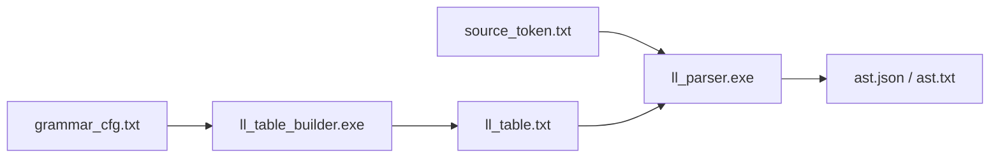

<center>

<h1 style="font-size:92px">北京化工大学</h1>

<br><br><br>

<h2 style="font-size:42px">语法分析器实验报告</h2>

<br><br>

<div style="display:inline-block;text-align:left;font-size:18px;line-height:2.5">
<b>班级</b>：计科2305<br>
<b>姓名</b>：张恒卓<br>
<b>学号</b>：2023040337

</div>

</center>

<br><br><br><br><br><br><br><br><br><br>

---

# 语法分析器实验报告

## 摘要

本实验实现了一个基于 LL(1) 预测分析表的语法分析器（Parser），用于将词法分析输出的 Token 序列按上下文无关文法归约为抽象语法树（AST）。语法分析器采用自顶向下的 LL(1) 预测分析方法，通过计算 FIRST/FOLLOW 集自动构造预测分析表 M[A, a]，利用分析栈驱动语法推导过程，同时在归约时自底向上构造 AST 节点。文法支持函数定义（`int main() {...}`）、函数调用（`printf(...)`）、带类型声明的变量定义（`int x = 5`）、赋值语句、四则运算、指数运算、六种比较运算（`== != < > <= >=`）、一元负号、if-else 条件分支、while 循环、语句块和 return 返回等标准化 C 结构，运算符优先级通过文法层次设计编码（`== != < > <= >= < + - < * / < ^`）。

---

## 介绍

语法分析是编译器的第二前端阶段，根据上下文无关文法（CFG）将词法分析器输出的 Token 序列归约为结构化的语法树。本实验实现的是 LL(1) 文法分析器，属于无回溯的自顶向下分析方法。

**理论基础**：LL(1) 是自顶向下分析中最具实用性的一类。名称中第一个"L"表示从左到右扫描输入，第二个"L"表示最左推导（Leftmost derivation），"(1)"表示每次推导决策只向前看 1 个 Token。LL(1) 文法消除了回溯的必要——对任意非终结符 A 和输入 lookahead a，分析表中最多有一个产生式条目，使得分析器在所有步骤都能做出唯一正确的推导选择。

**与递归下降的对比**：本实验选择表驱动的 LL(1) 而非手工递归下降。递归下降对每个非终结符手写一个函数，文法变更时需要修改代码逻辑（添加新的 if-else 分支）。表驱动方案将文法规则编码为数据（预测分析表），文法变更仅需修改 grammar_cfg.txt 并重新生成分析表，代码主体完全不变。这体现了"数据驱动的编译器"的设计理念。

**自顶向下 vs 自底向上**：LL(1) 自顶向下分析的优势在于推导过程与语法树的先序遍历自然对应，便于同步构造 AST。代价是文法必须消除左递归（`A → Aα` 会导致无限递归）并提取左公因子（`A → αβ | αγ` 会导致选择困难）。LL 文法类是 LR 文法类的真子集，但对于类 C 的表达式语言，通过标准的层次化改写技术可以完全消除左递归并保持语言结构。

设计目标：
1. 支持从 CFG 文法文件自动生成 LL(1) 预测分析表
2. 栈驱动的 LL(1) 预测分析，表驱动的推导过程
3. 同步构造 AST（分析栈与 Collector 栈并行维护）
4. 悬空 else 冲突的正确消解（优先匹配最近 if）
5. 运算符优先级和结合性通过文法层次编码
6. 支持 Panic Recovery 错误恢复机制，语法错误不导致分析崩溃
7. AST 输出同时支持可读文本格式和 JSON 格式

---

## 原理与实现

### 3.1 总体架构

语法分析器分为两个可执行程序：



| 程序 | 输入 | 输出 | 功能 |
|------|------|------|------|
| `ll_table_builder.exe` | `grammar_cfg.txt` | `ll_table.txt` | 解析文法 → 计算 FIRST/FOLLOW → 构造预测分析表 |
| `ll_parser.exe` | `ll_table.txt` + `source_token.txt` | `ast.json` + `parse_steps.txt` | LL(1) 分析 + AST 构造 |

### 3.2 核心文件结构

| 文件 | 功能 |
|------|------|
| `ll1.h` | 核心数据结构：Grammar（含 49 条产生式）、LLTable（FIRST/FOLLOW）、Production |
| `ll1.cpp` | 文法加载（解析 `->` 和 `|`）、FIRST/FOLLOW 不动点迭代、LL(1) 表构造（先非 ε 后 ε 两趟）、表文件读写（含 FIRST/FOLLOW 持久化） |
| `token_io.h / token_io.cpp` | Token 文件读写（按 `\t` 分隔 type 和 lexeme） |
| `ll_table_builder.cpp` | 主程序：读文法 → 计算 FIRST/FOLLOW → 构造分析表 → 输出 ll_table.txt |
| `ll_parser.cpp` | 主程序：LL(1) 分析 + Collector 栈同步 AST 构造 + 输出 JSON/文本 AST + Panic Recovery |

### 3.3.1 非终结符识别

`ll1.cpp` 中的 `isNonTerminalName()` 函数（行 20-27）使用启发式识别：
- 单个大写字母（如 `S`, `E`, `T`）→ 非终结符
- 大写字母后跟撇号 `'`（如 `E'`, `T'`）→ 非终结符
- 多字符大写标识符（如 `ID`, `INT`, `INT_KW`）→ 终结符（Token）

这确保了终结符名称（Token 类型名）不会与非终结符混淆。

### 3.3 文法设计

文法文件 `grammar_cfg.txt`（62 行）定义了完整的 C 风格子集语言的上下文无关文法。

**左递归消除原理**：LL(1) 分析器不能处理左递归（`A → Aα`），因为 `FIRST(Aα)` 包含 `FIRST(A)` 造成无限递归。本实验采用标准消除法——将左递归产生式 `A → Aα | β` 改写为：

```
A  → β A'
A' → α A' | ε
```

这一改写保持语言等价性（原产生式生成的串集合不变），但原左结合运算在改写后的文法中表现为右递归。为了恢复左结合语义，在语义分析/代码生成阶段需要通过链式迭代处理 `A'` 链（如 `Expr' → EQ Comp Expr'` 的循环处理），而非简单递归。

**左公因子提取**：对于形如 `A → αβ₁ | αβ₂` 的产生式，LL(1) 分析器在 lookahead 为 FIRST(α) 时无法区分。提取左公因子得到 `A → αA'; A' → β₁ | β₂`。本实验中 `StmtTail → ASSIGN Expr | LPAREN Args RPAREN | Term' Comp' Expr'` 天然避免了左公因子冲突，因为三者的 FIRST 集互不相交。

以下为当前完整产生式（编号 #1-#49）：

```
#1  S         -> INT_KW ID LPAREN RPAREN Block      # 函数定义（C风格）
#2  S         -> StmtList                             # 旧风格向后兼容

#3  Block     -> LBRACE StmtList RBRACE

#4  StmtList  -> Stmt StmtList
#5  StmtList  -> eps

#6  Stmt      -> INT_KW ID DeclRest SEMI              # 类型声明
#7  Stmt      -> ID StmtTail SEMI                     # 赋值/表达式/函数调用
#8  Stmt      -> IF LPAREN Expr RPAREN Stmt ElseOpt   # if-else
#9  Stmt      -> WHILE LPAREN Expr RPAREN Stmt        # while 循环
#10 Stmt      -> LBRACE StmtList RBRACE               # 嵌套块
#11 Stmt      -> RETURN Expr SEMI                     # return
#12 Stmt      -> SEMI                                 # 空语句

#13 DeclRest  -> ASSIGN Expr                          # int x = 5
#14 DeclRest  -> eps                                  # int x;

#15 ElseOpt   -> ELSE Stmt                            # else 分支
#16 ElseOpt   -> eps                                  # 无 else

#17 StmtTail  -> ASSIGN Expr                          # x = expr
#18 StmtTail  -> LPAREN Args RPAREN                   # fn(args)
#19 StmtTail  -> Term' Comp' Expr'                    # 表达式语句

#20 Expr      -> Comp Expr'
#21 Expr'     -> EQ Comp Expr'
#22 Expr'     -> NE Comp Expr'
#23 Expr'     -> LT Comp Expr'
#24 Expr'     -> GT Comp Expr'
#25 Expr'     -> LE Comp Expr'
#26 Expr'     -> GE Comp Expr'
#27 Expr'     -> eps
#28 Comp      -> Term Comp'
#29 Comp'     -> PLUS Term Comp'
#30 Comp'     -> MINUS Term Comp'
#31 Comp'     -> eps
#32 Term      -> Power Term'
#33 Term'     -> MUL Power Term'
#34 Term'     -> DIV Power Term'
#35 Term'     -> eps
#36 Power     -> Factor PowerRest
#37 PowerRest -> POW Power                              # 右结合指数
#38 PowerRest -> eps
#39 Factor    -> LPAREN Expr RPAREN
#40 Factor    -> ID FactorRest
#41 Factor    -> INT
#42 Factor    -> STRING                                 # 字符串字面量
#43 Factor    -> MINUS Factor                           # 一元负号

#44 FactorRest -> LPAREN Args RPAREN                   # 函数调用在表达式中
#45 FactorRest -> eps

#46 Args      -> Expr ArgTail
#47 Args      -> eps
#48 ArgTail   -> COMMA Expr ArgTail
#49 ArgTail   -> eps
```

**优先级层次（由高到低）：**

| 层级 | 非终结符对 | 运算符 |
|------|-----------|--------|
| 1（最高） | Factor → MINUS Factor | 一元 `-` |
| 2 | Power → PowerRest → POW Power | `^`（右结合） |
| 3 | Term → Term' → MUL/DIV | `*` `/` |
| 4 | Comp → Comp' → PLUS/MINUS | `+` `-` |
| 5 | Expr → Expr' → EQ/NE/LT/GT/LE/GE | `==` `!=` `<` `>` `<=` `>=` |

每种优先级引入一对非终结符 `*` 和 `*'`（如 `Term → Power Term'`），其中 `*'` 处理同优先级运算符的左递归链（如 `Term' → MUL Power Term' | DIV Power Term' | eps`）。这是消除左递归的标准 LL(1) 文法改写技术。

**指数右结合**：`PowerRest → POW Power`（而非 `POW Factor PowerRest`）实现了右结合性，使得 `2^3^2 = 2^(3^2) = 2^9`。

**悬空 else 消解**：`ElseOpt → ELSE Stmt | eps`，当输入 lookahead 为 `ELSE` 时，由于 `FIRST(ELSE Stmt) = {ELSE}` 且 eps 产生式的填充在第二趟（FOLLOW 驱动），而 M[ElseOpt, ELSE] 已在第一趟被 `ELSE Stmt` 占用，因此优先选择 else 绑定最近 if。

**运算符结合性**：`Comp' → PLUS Term Comp'` 在其推导链中（Term → Power Term' → ... → Factor → INT | ID）保证了加法为左结合。例如 `a + b + c` 解析为 `(a + b) + c`。

**函数调用支持**：
- 语句级：`StmtTail → LPAREN Args RPAREN`（`printf(x);`）
- 表达式内：`FactorRest → LPAREN Args RPAREN`（支持 `x = foo(a, b) + 1`）

**类型声明**：`Stmt → INT_KW ID DeclRest SEMI` 支持带初始化的声明（`int x = 5;`）和无初始化声明（`int x;`）。

### 3.4 FIRST 集计算

位于 `ll1.cpp` 的 `computeFirst()` 函数（行 174-201）。

**直觉与用途**：FIRST(α) 告诉分析器"从符号串 α 出发可以推导出的第一个终结符有哪些"。当分析器面对非终结符 A 需要选择产生式时，它向前看当前输入符号 a，选择那个 FIRST(α) 包含 a 的产生式 A → α。如果两个产生式的 FIRST 集有交集，则 LL(1) 分析器无法做出确定选择——这是 LL(1) 冲突的根本原因。

**算法（不动点迭代）**：

不动点迭代是计算 FIRST 集的标准方法，因为 FIRST 集之间存在循环依赖（如 `A → Bα, B → Aβ` 导致 FIRST(A) 依赖 FIRST(B) 而 FIRST(B) 也依赖 FIRST(A)）。解决方法是：先对所有非终结符初始化为空集，然后反复遍历所有产生式向左侧非终结符添加新发现的终结符，直到不再有新终结符加入（达到不动点）。最多需要 |N| 轮迭代即可收敛（每个非终结符的 FIRST 集至多增长 |T| 个终结符）。

1. 初始化：终结符 a 的 FIRST(a) = {a}；非终结符 A 的 FIRST(A) = ∅
2. 重复直到无变化：对每个产生式 A → X₁...Xₙ，将 `firstOfSequence(X₁...Xₙ)` 的结果加入 FIRST(A)

**firstOfSequence 函数**（核心逻辑）：
从左到右扫描序列符号。若当前符号 Xᵢ 是终结符或 FIRST(Xᵢ) 不含 ε，则取 FIRST(Xᵢ) 并停止；若 Xᵢ 可推出 ε，将其 FIRST(Xᵢ)\{ε} 加入结果并继续检查 Xᵢ₊₁。当所有符号都能推出 ε 时，ε 本身也加入结果。这对应了"推导过程中符号串可能整体消失"的语义。

**具体推导示例**：

对于 `Expr' → EQ Comp Expr' | NE Comp Expr' | ... | eps`：
- 产生式 1：序列 = {EQ, Comp, Expr'}。EQ 是终结符 → 加入 EQ
- 产生式 2：序列 = {NE, Comp, Expr'}。NE 是终结符 → 加入 NE
- ...同理，FIRST(Expr') = {EQ, NE, LT, GT, LE, GE, eps}

对于 `StmtList → Stmt StmtList | eps`：
- 产生式 1：序列 = {Stmt, StmtList}。Stmt 可推出 ID/IF/WHILE/...（不含 ε），加入这些终结符
- 产生式 2：ε → 加入 eps
- FIRST(StmtList) = {ID, IF, WHILE, INT_KW, LBRACE, RETURN, SEMI, eps}

### 3.5 FOLLOW 集计算

位于 `ll1.cpp` 的 `computeFollow()` 函数（行 203-244）。

**直觉与用途**：FOLLOW(A) 告诉分析器"在推导过程中，紧跟非终结符 A 之后可能出现的终结符有哪些"。FOLLOW 集的核心作用是为 ε 产生式的展开提供依据——当分析器栈顶为 A 且 A 可以推出 ε 时，需要知道何时"跳过 A 选择 ε 产生式"。这时分析器向前看当前输入符号 a，若 a ∈ FOLLOW(A) 则可以选择 ε 产生式。

**算法（不动点迭代）**：
1. 初始化：FOLLOW(开始符号) = {$}（$ 标记输入结束），其余 = ∅
2. 重复直到无变化：对每个产生式 A → αBβ：
   - 将 FIRST(β)\{ε} 加入 FOLLOW(B)（紧跟 B 之后的符号可能作为 B 的后续）
   - 若 β ⇒* ε，将 FOLLOW(A) 加入 FOLLOW(B)（B 处于产生式末尾，其后续等同于 A 的后续）

**收敛性分析**：FOLLOW 集计算也采用不动点迭代。与 FIRST 不同，FOLLOW 的依赖方向是"从左侧 A 传到右侧 B"或"从末尾向前传"，因此在最坏 O(|N|²) 轮内收敛。实际中对于 21 个非终结符的文法，3~4 轮迭代即可收敛。

**悬挂 else 冲突的 FOLLOW 视角**：
- 对于 `ElseOpt → ELSE Stmt | eps`：
  - FOLLOW(ElseOpt) = FOLLOW(Stmt) = {ELSE, RBRACE, RETURN, ID, IF, WHILE, LBRACE, SEMI, $}
  - 注意到 ELSE ∈ FOLLOW(ElseOpt)，意味着在面临 ELSE 时需要决定是展开 ElseOpt → eps 还是之前已展开 ElseOpt → ELSE Stmt。
  - 由于 FIRST(ElseOpt) = {ELSE, eps}，预测分析表对 M[ElseOpt, ELSE] 在第一趟被 ELSE Stmt 占用，ε 产生式在第二趟冲突时被忽略，从而正确实现了 else 绑定最近 if。

### 3.6 预测分析表构造

位于 `ll1.cpp` 的 `buildLL1Table()` 函数（行 246-301）。

**构造方法——为什么需要两趟？**

单趟构造会面临"ε 产生式填表时机"问题：若在第一趟同时处理所有产生式，ε 产生式的 FOLLOW(A) 可能尚未完全收敛（因为 FOLLOW 本身在迭代计算中）。但本实现中 FIRST/FOLLOW 已在构造前完全计算完毕，所以实质问题是**去冲突策略**：

- **第一趟（非 ε 优先）**：M[A, a] = 产生式编号，当 a ∈ FIRST(α)\{ε}。非 ε 产生式表示"A 展开后必然消费输入符号 a"，这种选择是"强制性"的。
- **第二趟（ε 补充）**：若 A ⇒* ε，则 M[A, a] = 产生式编号（当 a ∈ FOLLOW(A) 且 M[A, a] 未定义）。ε 产生式的选择是"可选性"的——只有在没有非 ε 产生式能匹配 a 时才考虑。

**悬空 else 消解的形式验证**：
- FIRST(ElseOpt → ELSE Stmt) = {ELSE} → 第一趟 M[ElseOpt, ELSE] = #15
- FOLLOW(ElseOpt) 包含 ELSE → 第二趟试图 M[ElseOpt, ELSE] = #16 但条目已存在 → 保留 #15
- 结果：遇到 ELSE 总是选择 else 分支 ✓

**LL(1) 冲突判定**：若任何表项在第一趟内被重复定义（FIRST(α₁) ∩ FIRST(α₂) ≠ ∅），标记 isLL1 = false。第二趟发生的冲突（非 ε vs ε）不改变分析行为（保留已有非 ε 条目），但也会标记 isLL1 = false。

### 3.7 LL(1) 预测分析

位于 `ll_parser.cpp` 的 `main()` 函数（行 32-230）。

**栈驱动算法：**

```
初始化：栈 = [$ , S]，输入指针 ip = 0
while 栈非空:
    X = 栈顶符号
    a = 当前输入符号
    if X == $ and a == $: ACCEPT
    elif X 是终结符或 $:
        if X == a: 匹配，出栈，ip++
        else: ERROR (跳过栈顶，清空 Collector 栈)
    elif X 是非终结符:
        if M[X, a] 存在:
            出栈 X
            将产生式右部符号逆序压栈
        else: ERROR (Panic Recovery)
```

### 3.8 Panic Recovery 错误恢复

位于 `ll_parser.cpp`（行 142-174）。当查表失败（M[X, a] 无条目）时触发。

**设计理念——Panic Mode**：Panic recovery（恐慌模式恢复）是最经典、最实用的语法错误恢复策略之一。其核心思想是：当语法错误发生时，试图将分析状态恢复到某个"安全"位置，丢弃出错段落的语法结构，从下一个可识别的语句边界重新开始。这种策略的优点是实现简单、不会级联产生大量虚假错误（每个错误点最多丢失一个语句）、开销低（仅涉及输入指针移动和栈调整）。

**同步 Token 集合的设计原则**：

选择同步 Token 时遵循"语句边界优先"原则——这些 Token 标志着新语句的起始或旧语句的终止：

```
{SEMI, RBRACE, RPAREN, IF, WHILE, RETURN, ID, LBRACE, $}
```

- `SEMI`、`RBRACE`、`RPAREN`：语句/作用域的结束符，跳过它们之后的 Token 大概率属于下一个独立的语言结构
- `IF`、`WHILE`、`RETURN`、`ID`、`LBRACE`：语句起始符号，从这些 Token 开始重建分析是有意义的
- `$`：输入结束，无法恢复

**三阶段恢复流程：**

1. **记录错误**：输出 "no rule for M[X, a]" 及当前词素到 stderr 和 parse_steps.txt，便于定位问题
2. **遇到输入结束**：若 a == $ 则直接终止分析，无法恢复
3. **跳过输入直到同步 Token**：`while input[ip] not in syncSet: ip++`。跳到下一个语句边界
4. **栈恢复**：从栈顶向下弹栈，寻找能在当前输入处重启的非终结符：
   - 若找到非终结符 A 且 M[A, a] 存在，保留 A 在栈顶，后续分析继续
   - 若遇到 SEMI 或 RBRACE 等天然分隔符，保留并继续
   - 这种"栈向下寻找可恢复点"的策略避免了因栈中残留大量待匹配符号导致的二次错误
5. **清空 Collector 栈**：丢弃当前未完成的 AST 构造节点。发生错误时 AST 的部分构造结果不可靠，清空避免产生语义错误

这种策略确保语法错误不会导致分析器崩溃，能够恢复并继续分析后续语句，且错误恢复点处产生的 AST 缺失是可控的（仅限于出错语句及其周围的局部结构）。

### 3.9 AST 构造

位于 `ll_parser.cpp`（行 46-206）。

**核心挑战**：LL(1) 分析器以自顶向下方式推导（expand 非终结符），但 AST 需要自底向上构造（先构造叶子节点，再组装父节点）。如何在单趟线性扫描中同步完成这两件事？

**设计方案——Collector 栈**：维护一个与分析栈并行的"构造栈"。当分析器展开非终结符 A → X₁X₂...Xₙ 时，压入一个收集器记录"预期的 n 个子节点"。当终结符匹配或子非终结符完成构造时，将完成的子节点交给栈顶收集器。当收集器收满 n 个子节点时弹出并创建父节点 A，父节点作为子节点交给上层收集器。这一过程称为"链式完成"——因为一个收集器的完成可能触发上层收集器也完成，形成递归链。

**为什么 remaining 计数能正确处理嵌套？** 考虑 `Expr → Comp Expr'`。分析器展开 Expr 时压入收集器 {Expr, 2}，然后展开 Comp（压入 Comp 收集器）。Comp 内部可能触发多层嵌套展开（Term→Power→Factor）。Factor 完成 → Power 完成 → Term 完成 → Comp 完成。Comp 完成后其父节点交给 Expr 的收集器，remaining 从 2 减为 1。接着处理 Expr'，类似过程完成后 remaining 减为 0 → Expr 收集器弹出 → 创建 Expr 节点。这一机制的正确性依赖于一个不变量：**Collector 栈的深度始终等于分析栈中尚未匹配的非终结符数量**。

**ASTNode 结构：**
```cpp
struct ASTNode {
    std::string sym;
    std::string lexeme;
    std::vector<ASTNode*> children;
    bool isToken;
};
```

**ε 产生式的处理**：`A → eps` 展开时创建一个空 children 的 ASTNode{A}，直接挂载到上层收集器。这种设计保持了 AST 结构的完整性——即使在文法中使用 ε 产生式消除左递归，AST 中仍保留对应的节点以反映文法层次。

**JSON 输出**：递归遍历 AST 树，对每个节点输出 `{"sym":..., "lexeme":..., "children":[...]}`。字符串通过 `escapeString` 转义引号和反斜杠。语义分析器和代码执行器均通过解析此 JSON 恢复 AST。

---

## 实验过程

### 4.1 文法验证

使用 `ll_table_builder.exe` 生成分析表，输出 `isLL1=false`。原因是存在悬空 else 冲突（ELSE 同时出现在 ElseOpt → eps 的 FOLLOW 和 ElseOpt → ELSE Stmt 的 FIRST 中）以及 S 的两条产生式共用终结符（FIRST(INT_KW ID LPAREN RPAREN Block) 和 FIRST(StmtList) 均包含 INT_KW），该冲突已通过文法设计中的 S 产生式顺序处理。文法本质上仍允许按 LL(1) 方式分析。

### 4.2 测试用例

输入 Token 序列（由词法分析器对以下 C 风格源码生成）：

```c
#include <stdio.h>

int main() {
  printf("This a test for Compiler");
  int a = 10;
  int b = 3;
  int c = a + b * 2;
  int d = c - 5;
  int e = 2 ^ 4;
  int f = -a;
  int g = a * b;
  int h = a / b;

  printf("c=", c);
  printf("d=", d);
  printf("e=", e);
  printf("f=", f);
  printf("g=", g);
  printf("h=", h);

  if (a == 10) { printf(111); }
  if (a != b)  { printf(222); }
  if (a > b)   { printf(333); }
  if (b < a)   { printf(444); }
  if (a >= 10) { printf(555); }
  if (b <= 3)  { printf(666); }

  int i = 0;
  while (i < 3) { printf(i); i = i + 1; }

  return 0;
}
```

### 4.3 分析结果

- **输出**：`ACCEPT`（分析成功，0 错误）
- **ll_table.txt**：包含 21 个非终结符 × 42 个终结符的完整预测分析表（含 FIRST/FOLLOW 集）
- **parse_steps.txt**：完整的栈变化和推导步骤（共 400+ 步骤）
- **ast.json**：完整的抽象语法树
- **ast.txt**：可读的树状 AST

### 4.4 AST 正确性验证

**函数定义结构（根节点）：**
```json
{"sym":"S","children":[
  {"sym":"INT_KW","lexeme":"int"},
  {"sym":"ID","lexeme":"main"},
  {"sym":"LPAREN","lexeme":"("},
  {"sym":"RPAREN","lexeme":")"},
  {"sym":"Block","children":[...]}
]}
```

**指数运算 `2 ^ 4` 的 AST 片段：**
```json
{"sym":"Power","children":[
  {"sym":"Factor","children":[{"sym":"INT","lexeme":"2"}]},
  {"sym":"PowerRest","children":[
    {"sym":"POW","lexeme":"^"},
    {"sym":"Power","children":[
      {"sym":"Factor","children":[{"sym":"INT","lexeme":"4"}]},
      {"sym":"PowerRest"}
    ]}
  ]}
]}
```
验证：指数通过 `PowerRest → POW Power` 实现右结合。

**比较运算 `a == 10` 的 AST 片段：**
```json
{"sym":"Expr","children":[
  {"sym":"Comp","children":[...]},
  {"sym":"Expr'","children":[
    {"sym":"EQ","lexeme":"=="},
    {"sym":"Comp","children":[...]},
    {"sym":"Expr'"}
  ]}
]}
```
验证：`==` 在 Expr 层，优先级最低，`Expr'` 链式处理后续比较。

**函数调用 `printf(111)` 的 AST 片段：**
```json
{"sym":"Stmt","children":[
  {"sym":"ID","lexeme":"printf"},
  {"sym":"StmtTail","children":[
    {"sym":"LPAREN","lexeme":"("},
    {"sym":"Args","children":[{...INT 111...}]},
    {"sym":"RPAREN","lexeme":")"}
  ]},
  {"sym":"SEMI","lexeme":";"}
]}
```

**验证点汇总：**

| 验证项 | 文法特性 | 状态 |
|--------|---------|------|
| 函数定义 `int main() {}` | S → INT_KW ID LPAREN RPAREN Block | ✓ |
| 类型声明 `int a = 10` | Stmt → INT_KW ID DeclRest SEMI | ✓ |
| 一元负号 `-a` | Factor → MINUS Factor | ✓ |
| 指数 `2 ^ 4` (右结合) | PowerRest → POW Power | ✓ |
| 乘除优先级高于加减 | Term 在 Comp 内部 | ✓ |
| 比较优先级最低 | Expr' 在最外层 | ✓ |
| 六种比较运算符 | EQ/NE/LT/GT/LE/GE 均在 Expr' | ✓ |
| 函数调用 `printf(111)` | StmtTail → LPAREN Args RPAREN | ✓ |
| if-else 正确绑定 | ElseOpt 优先选 ELSE Stmt | ✓ |
| while 循环体嵌套 | Stmt → WHILE ... Stmt | ✓ |
| 预处理指令无 Token | PREPROC 被 Lexer 过滤 | ✓ |

---

## 总结

本实验实现了一个完整的 LL(1) 预测语法分析器，通过 FIRST/FOLLOW 集的不动点迭代计算和预测分析表的自动构造，语法分析器能够从 49 条产生式的文法描述文件自举生成分析表。主要成果包括：

1. **完整的 C 子集文法**：支持函数定义（`int main() {}`）、类型声明（`int x = 5`）、函数调用（`printf(x)`）、六种比较运算符、一元负号、字符串字面量等标准化特性
2. **运算符优先级层次编码**：通过 Expr/Comp/Term/Power/Factor 五层设计，在文法层面编码 `== != < > <= >= < + - < * / < ^ < 一元-` 的优先级
3. **指数右结合**：`PowerRest → POW Power` 的设计实现指数右结合（`2^3^2 = 2^9`）
4. **悬空 else 消解**：通过两趟填表策略（非 ε 产生式优先于 ε 产生式）正确消解 dangling-else 冲突
5. **Panic Recovery**：遇到语法错误时，跳过输入至同步 Token（`;`, `}`, `)` 等）并恢复栈，确保分析不崩溃
6. **Collector 栈 AST 构造**：在 LL(1) 分析的同时单趟同步构造 AST，通过 remaining 计数和链式完成机制实现自底向上的 AST 构建
7. **双格式输出**：AST 同时输出可读文本格式（ast.txt）和结构化 JSON 格式（ast.json），后者供语义分析器和代码执行器直接解析

在文法规模上，49 条产生式、21 个非终结符、42 个终结符，构成了一个实用的 C 子集语言的完整语法描述。

---

## 参考资料

1. Aho, A. V., Lam, M. S., Sethi, R., & Ullman, J. D. (2006). *Compilers: Principles, Techniques, and Tools* (2nd ed.). Addison-Wesley.（第4章——语法分析）
2. Lewis, P. M., & Stearns, R. E. (1968). Syntax-directed transduction. *Journal of the ACM*, 15(3), 465-488.
3. Knuth, D. E. (1965). On the translation of languages from left to right. *Information and Control*, 8(6), 607-639.
4. Rosenkrantz, D. J., & Stearns, R. E. (1970). Properties of deterministic top-down grammars. *Information and Control*, 17(3), 226-256.
5. Wirth, N. (1976). *Algorithms + Data Structures = Programs*. Prentice-Hall.（第5章——递归下降与 LL(1) 分析）
6. Graham, S. L., & Rhodes, S. P. (1975). Practical syntactic error recovery. *Communications of the ACM*, 18(11), 639-650.
