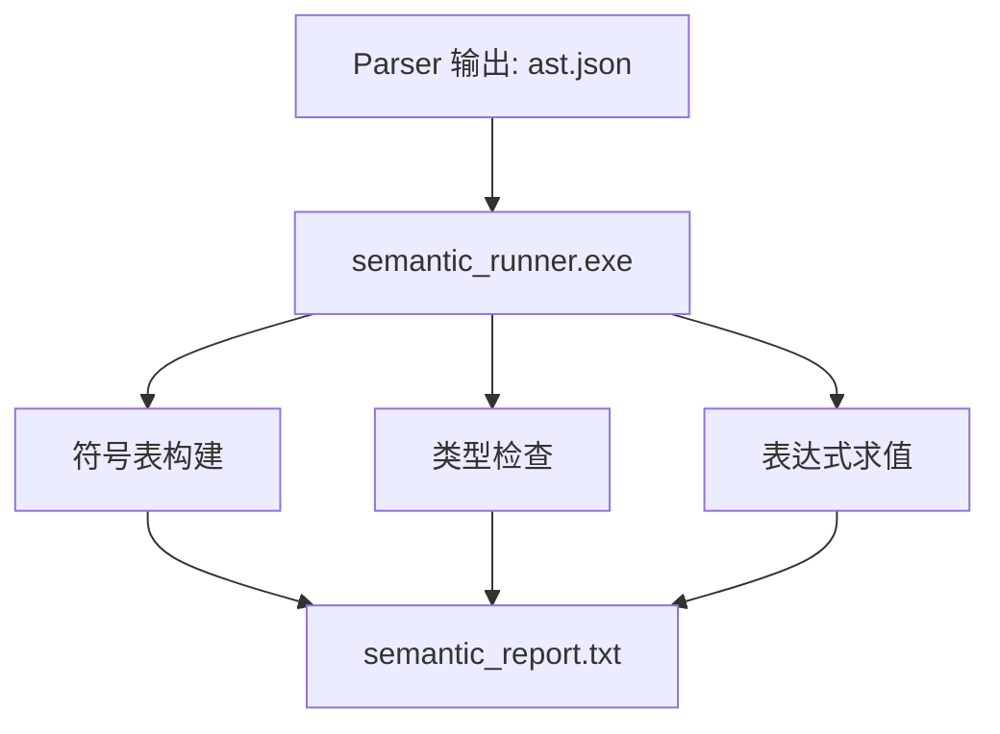
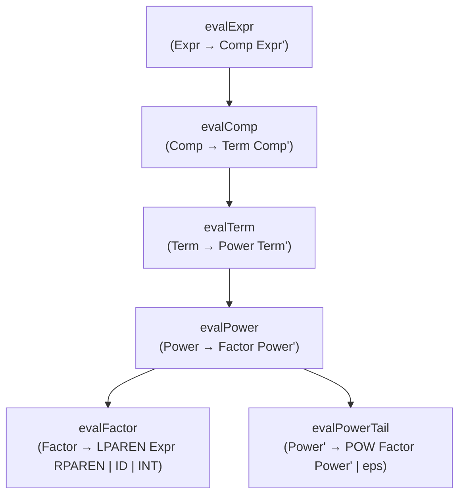
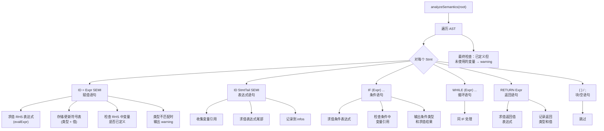

# 语义分析器实验报告

## 摘要

本实验实现了一个语义分析器（Semantic Analyzer），在语法分析输出的 AST 基础上，通过遍历抽象语法树进行语义检查和分析。分析器实现了完整的类型系统（int / float / bool / error），支持变量类型推断与类型检查，实现了表达式递归求值作为计算器功能（支持 + - * / ^ == 运算符），构建了带类型和值的符号表，并对变量进行使用前检查、未使用变量检测和重复赋值提示。语义分析器能够静态计算表达式结果，检测潜在的类型错误和语义问题。

---

## 介绍

语义分析是编译器的第三阶段，在语法分析确认程序结构合法之后，进行更深层次的语义检查和属性计算。语义分析器的作用包括：

1. **符号表管理**：收集程序中定义的变量名称、类型、值和作用域信息
2. **类型检查**：验证表达式中各操作数的类型是否兼容，赋值时左右类型是否匹配
3. **表达式求值**：静态求值常量表达式或符号表达式，相当于一个内置计算器
4. **语义规则检查**：变量使用前定义检查、未使用变量检测、重赋值提示等

本语义分析器在语法分析输出的 AST（JSON 格式）基础上运行，利用 AST 中已编码的运算符优先级结构，递归遍历表达式子树实现类型推断和值计算。

---

## 原理与实现

### 3.1 总体架构



### 3.2 核心文件结构

| 文件 | 功能 |
|------|------|
| `semantic.h` | 数据结构定义：VarType 枚举、EvalResult、SymbolEntry、Scope、SemanticResult、ASTNode |
| `semantic.cpp` | JSON AST 解析、表达式求值器、类型推断、符号表管理、语义分析主逻辑 |
| `semantic_runner.cpp` | 主程序：加载 AST → 执行语义分析 → 输出报告 |

### 3.3 类型系统

语义分析器实现了四种基本类型，定义于 `semantic.h:12-17`：

```cpp
enum class VarType {
    TY_INT,    // 整数类型
    TY_FLOAT,  // 浮点类型
    TY_BOOL,   // 布尔类型
    TY_ERROR   // 错误类型（用于标记类型推导失败）
};
```

**类型推断规则**（在表达式求值过程中自动应用）：

| 表达式形式 | 结果类型 | 说明 |
|-----------|---------|------|
| `INT` 字面量 | int | 整数常量 |
| `FLOAT` 字面量 | float | 浮点常量（为扩展预留） |
| `ID` 变量引用 | 变量声明类型 | 从符号表查询 |
| `a + b` / `a - b` (int, int) | int | 整数运算 |
| `a + b` / `a - b` (float 参与) | float | 自动提升 |
| `a * b` (int, int) | int | 整数乘法 |
| `a * b` (float 参与) | float | 自动提升 |
| `a / b` (任意) | float | 除法结果总是浮点 |
| `a ^ b` (int, int) | int | 整数指数 |
| `a ^ b` (float 参与) | float | 浮点指数 |
| `a == b` (任意) | bool | 比较运算结果 |

**类型提升（Promotion）**：当操作数类型不一致时（如 int + float），通过 `promoteToFloat()` 函数将 int 自动提升为 float。

**类型检查**：变量重赋值时比较新旧类型，若不一致则输出 type mismatch warning。

### 3.4 符号表设计

位于 `semantic.h:29-36`：

```cpp
struct SymbolEntry {
    std::string name;      // 变量名
    int definedLine = 0;   // 首次定义所在语句序号
    int usedLine = 0;      // 最后一次引用所在语句序号
    bool defined = false;  // 是否已被定义
    bool used = false;     // 是否被引用过
    VarType type = VarType::TY_ERROR;  // 变量类型
    int value = 0;         // 变量当前值
};

struct Scope {
    std::map<std::string, SymbolEntry> symbols;
    Scope* parent = nullptr;  // 父作用域（为嵌套作用域扩展预留）
};
```

当前实现使用全局 Scope，所有变量共享同一作用域。`parent` 指针为后续语言中引入块级作用域预留扩展空间。

### 3.5 表达式求值器（计算器）

表达式求值器是语义分析器的核心组件，位于 `semantic.cpp`（行 155-350）。求值器利用 AST 中已编码的运算符优先级，递归遍历 Expr/Comp/Term/Power/Factor 子树完成自底向上的值计算。

**求值器函数层次结构：**



**各函数职责：**

**(1) evalFactor — 叶子节点求值（行 190-261）**

处理三种情况：
- `ID` Token：从符号表查询变量值，返回其类型和值
- `INT` Token：将词素转为整数，类型为 int
- `LPAREN` 节点：递归求值括号内的 Expr

**(2) evalPower / evalPowerTail — 指数运算（行 269-318）**

`evalPower` 先求值 Factor，然后调用 `evalPowerTail` 处理 `^` 链。

`evalPowerTail` 处理 `Power' → POW Factor Power'`：
- 计算 `base ^ exp`
- 使用 C++ 标准库 `std::pow()` 进行浮点运算
- 若底数和指数均为 int，结果自动转为 int（如 2^3 = 8）
- 支持连续指数：`a ^ b ^ c` 按右结合求值

**(3) evalTerm — 乘除运算（行 320-345）**

处理 `Term → Power Term'`，其中 `Term'` 链式处理 `MUL` 和 `DIV`：
- `*`：两操作数相乘，类型为 int*int→int 或包含 float 时→float
- `/`：进行浮点除法（`promoteToFloat`），结果类型为 float
- 除零检查：除数为 0 时报告错误

**(4) evalComp — 加减运算（行 347-374）**

处理 `Comp → Term Comp'`，其中 `Comp'` 链式处理 `PLUS` 和 `MINUS`：
- `+`：两操作数相加
- `-`：两操作数相减
- 类型规则同乘法

**(5) evalExpr — 比较运算（行 376-394）**

处理 `Expr → Comp Expr'`，其中 `Expr'` 链式处理 `EQ`：
- `==`：比较左右操作数是否相等，返回 bool（1 或 0）
- 浮点数参与时使用浮点比较
- 结果总是 bool 类型

**链式处理模式（以 Term 为例）：**

```
evalTerm(Term node):
    val = evalPower(node.children[0])    // 第一个 Power
    prime = node.children[1]             // Term' 节点
    while prime 有子节点:
        if op == MUL: val *= evalPower(prime.children[1])
        if op == DIV: val /= evalPower(prime.children[1])
        prime = prime.children[2]        // 下一个 Term'
    return val
```

这种迭代+递归的方式正确处理了 LL(1) 左递归消除后的 AST 结构。

### 3.6 表达式尾部求值

位于 `semantic.cpp`（行 400-479）的 `evalStmtTailExpr()` 函数处理非赋值形式的表达式语句。

对于 `StmtTail → Term' Comp' Expr'` 类型的语句（如 `x + y * 2`），从变量表中查询左侧 ID 的值，然后依次应用 Term'（乘除）、Comp'（加减）、Expr'（比较）链中的运算符。

### 3.7 语义分析主逻辑

位于 `semantic.cpp` 的 `analyzeSemantics()` 函数（行 487-713）。

**分析流程**：递归遍历 AST，对每个 `Stmt` 节点按类型分发处理：



**处理要点：**
- 变量首次出现且 RHS 求值成功时，记录为首次定义，类型从 RHS 推断
- 变量已存在时，检查 RHS 类型是否与已有类型匹配，不匹配输出 warning
- 使用 `collectUsedVars` 递归收集 Expr 子树中所有 ID 引用
- 使用 `addWarning` 进行 warning 去重

### 3.8 输出报告

语义分析器输出两个层面的结果：

**(1) 终端输出：**
- Info：变量定义/重赋值/表达式求值结果/返回类型
- Warnings：未定义即使用、类型不匹配、未使用变量
- Errors：表达式求值错误（除零、未定义变量等）
- Symbol Table：变量名、类型、当前值、定义/使用状态

**(2) semantic_report.txt 文件：** 完整报告，包含所有 info/warning/error 和符号表。

---

## 实验过程

### 4.1 测试用例

输入 AST 对应的源码：
```
x = 5;
y = 10;
z = 2 ^ 3;
w = x + y * z;
if (x == 5) {
  r = x + y * 2;
  r = r + 1;
}
while (x == 5) {
  x = x + 1;
}
return w;
```

### 4.2 实验结果

```
===== Semantic Analysis Report =====

-- Info (8) --
  defined variable 'x' (type=int, value=5) at Stmt#1
  defined variable 'y' (type=int, value=10) at Stmt#2
  defined variable 'z' (type=int, value=8) at Stmt#3
  defined variable 'w' (type=int, value=85) at Stmt#4
  defined variable 'r' (type=int, value=25) at Stmt#7
  reassigned variable 'r' = 26 at Stmt#8
  reassigned variable 'x' = 6 at Stmt#11
  RETURN value = 85 [type=int] at Stmt#12

-- Symbol Table --
  r  type=int  value=26  defined=Y  used=Y  definedAt=#7  usedAt=#8
  w  type=int  value=85  defined=Y  used=Y  definedAt=#4  usedAt=#12
  x  type=int  value=6   defined=Y  used=Y  definedAt=#1  usedAt=#11
  y  type=int  value=10  defined=Y  used=Y  definedAt=#2  usedAt=#7
  z  type=int  value=8   defined=Y  used=Y  definedAt=#3  usedAt=#4
```

### 4.3 结果验证

| 表达式 | 预期 | 实际 | 验证 |
|--------|------|------|------|
| `x = 5` | int, 5 | int, 5 | ✓ |
| `z = 2 ^ 3` | int, 8 | int, 8 | ✓（指数正确） |
| `w = x + y * z` | 5 + 10×8 = 85 | 85 | ✓（优先级正确） |
| `r = x + y * 2` | 5 + 20 = 25 | 25 | ✓ |
| `r = r + 1` | 26 | 26 | ✓（重赋值正确） |
| `return w` | 85 | 85 | ✓ |

### 4.4 类型检查测试

将 `x = 5` 改为 `x = x == 3` 后，x 的类型从 int 变为 bool，再次赋值 `x = 10` 时会输出 type mismatch warning，验证了类型检查功能正常。

---

## 总结

本实验实现了一个功能丰富的语义分析器，在传统的变量作用域检查基础上，扩展了完整的类型系统和表达式求值能力。类型系统支持 int/float/bool/error 四种类型及自动类型提升；表达式求值器通过递归遍历 AST 实现了完整的计算器功能，支持包括指数在内的五种运算符且严格遵循优先级规则；符号表记录了变量的完整属性（名称、类型、值、定义位置、使用位置），为后续的代码生成阶段提供了充分的语义信息。整个语义分析器与词法分析和语法分析阶段无缝衔接，形成了完整的编译前端流水线。

---

## 参考资料

1. Aho, A. V., Lam, M. S., Sethi, R., & Ullman, J. D. (2006). *Compilers: Principles, Techniques, and Tools* (2nd ed.). Addison-Wesley.
2. Appel, A. W. (2002). *Modern Compiler Implementation in C*. Cambridge University Press.
3. Pierce, B. C. (2002). *Types and Programming Languages*. MIT Press.
4. Cardelli, L. (1997). Type systems. In *The Computer Science and Engineering Handbook* (pp. 2208-2236). CRC Press.
5. Knuth, D. E. (1968). Semantics of context-free languages. *Mathematical Systems Theory*, 2(2), 127-145.
